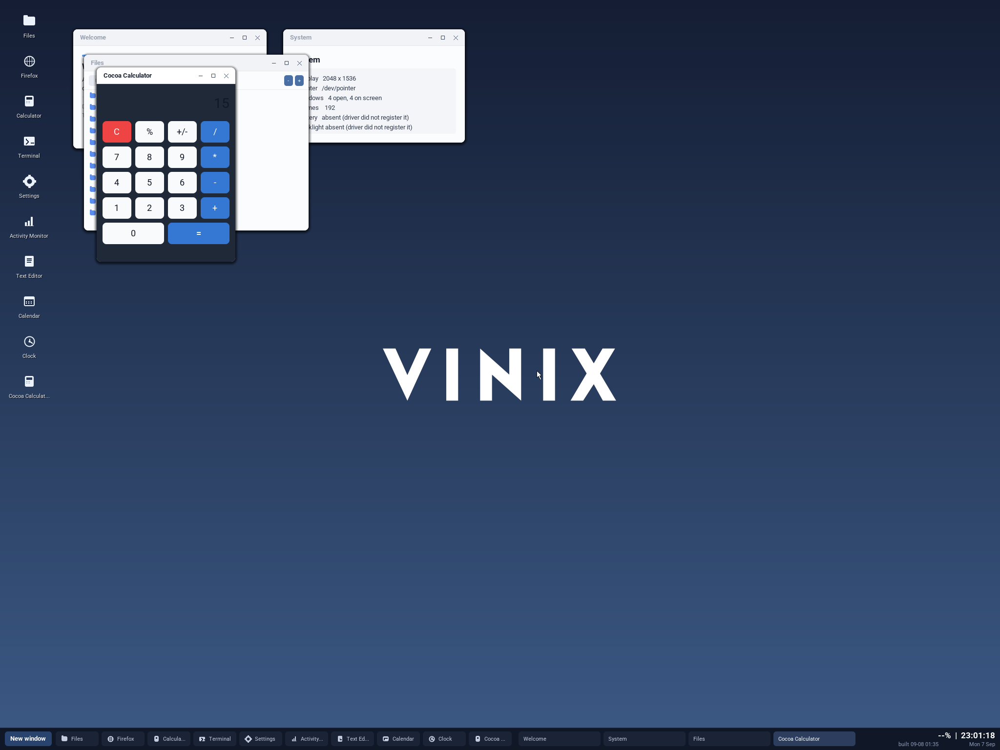

# Vinix macOS compatibility layer

This directory contains the first executable slice of a userspace macOS
compatibility layer. Its architecture follows the useful boundary established
by Darling: a small loader maps Mach-O in an ordinary host process, while a
userspace runtime supplies Darwin and framework behavior. No Mach-O parsing or
Objective-C dispatch runs in the Vinix kernel.

The compatibility implementation is V. `apps/Calculator/main.m` is
intentionally the test input: it is a real Objective-C Cocoa application, compiled to an AArch64
Mach-O and linked with normal AppKit imports. No Apple library or framework is
copied into the Vinix image.



## Supported today

- thin AArch64 Mach-O executables and AArch64 slices in fat Mach-O containers
- `LC_SEGMENT_64`, `LC_MAIN`, `LC_SYMTAB`, and classic dyld rebase/bind streams
- XML `Info.plist` lookup of `CFBundleExecutable`
- the Objective-C message ABI needed by the calculator
- a small AppKit façade: `NSApplication`, `NSWindow`, `NSView`, `NSButton`, and
  `NSTextField`, rendered by the native Vinix desktop compositor

Modern chained fixups, arbitrary dylibs, Darwin syscalls, Objective-C ARC,
threads, nib/storyboard loading, and the rest of Cocoa are not yet supported.
The loader rejects unsupported fixup formats and unresolved imports instead of
silently treating an arbitrary macOS application as compatible.

## Tests

Run the parser, bundle, and dyld opcode tests:

```sh
v test compat/macos/bundle compat/macos/macho
```

On an AArch64 macOS host, build and execute the actual Mach-O calculator in the
V runtime:

```sh
tests/macos/run.sh
```

With the Vinix AArch64 musl sysroot, kernel, QEMU, and firmware already built,
boot the same test as `/sbin/init` and require its arithmetic action to pass:

```sh
tests/macos/run-vinix.sh
```

The normal desktop build stages `Calculator.app` under `/Applications` and adds
a **Cocoa Calculator** launcher:

```sh
./build-desktop-aarch64.sh
./run-desktop-aarch64.sh --no-build
```
