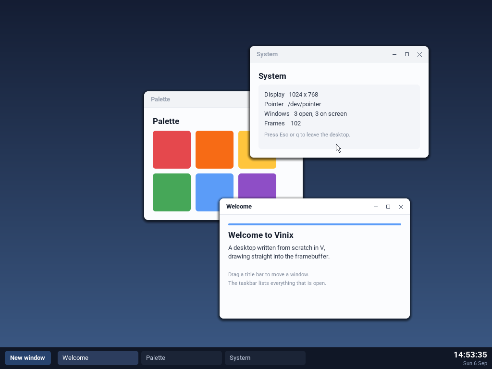

# vinix-desktop

A small desktop environment for Vinix, written in V and built on
[ui2](https://github.com/vlang/ui2)'s declarative element tree.

It maps `/dev/fb0`, reads the pointer from `/dev/pointer` and the keyboard from
its controlling terminal, and composes every frame itself: there is no display
server, no GPU and no toolkit underneath it.

What it does:

- a wallpaper, and a taskbar along the bottom listing every open window
- a clock in the bottom right corner — time above, date below
- windows with a title bar, a close, a maximise/restore and a minimise button
- dragging a window by its title bar, clicking one to bring it to the front
- a **New window** button, so the taskbar list can be seen growing and shrinking
- **shortcuts down the left edge of the wallpaper**, and matching taskbar
  launchers, for every application the desktop can open
- a **file browser** over the real filesystem: directories first, sizes, and a
  way back up
- a **settings application**: window button side, taskbar style, theme and
  wallpaper, applied to the running desktop as they are chosen
- **hosted ui2 applications**: ui2's own examples run in windows of their own,
  several at a time, each with its own state
- **Cmd-Tab**, which switches windows on a tap and shows all of them in the
  middle of the screen when it is held

Keys: `Ctrl-Q` leaves the desktop, `Ctrl-N` opens a window, `Ctrl-K` the first
application. They are chords rather than bare letters because they fire
whenever no application holds the keyboard, which on a machine whose pointer
does not work is most of the time -- and `q` meaning "close the desktop" makes
typing any word with a q in it drop the user back to the console.

## How it fits together

    main.v         the event loop: poll input, rebuild, render, present
    wm.v           the window manager — window list, the ui2 tree, hit routing
    window.v       the Window model and the pages windows show
    app.v          hosting applications in windows, and which ones there are
    files.v        the file browser
    switcher.v     Cmd-Tab: the session it opens and the panel it shows
    settings.v     the preferences: themes, wallpaper, Display and Battery
    settings_app.v the settings application
    wallpaper.v    loading and scaling a wallpaper photograph
    backlight_client.v / battery_client.v  native V device clients
    platform.c.v   V POSIX bindings, terminal state, mmap, clocks and directories
    render.v       a ui2 backend that draws an element tree into a framebuffer
    canvas.v       the software renderer: spans, rounded rects, clipping, blend
    font.v         text, from the coverage atlases in font_data.v
    framebuffer.v  /dev/fb0: geometry over ioctl, pixels over mmap
    input.v        /dev/pointer, and the terminal in raw mode
    clock.v        CLOCK_REALTIME and the calendar arithmetic on top of it
    theme.v        every colour and measurement in one place

The interesting part is the split between `wm.v` and `render.v`. The window
manager never draws: it describes the whole screen as a `ui2.Element` tree —
views, labels and buttons with frames, box styles and text styles — and hands
that to the renderer. The renderer paints the tree and, in the same walk,
records every clickable and draggable element's absolute rectangle. Clicks are
routed by hit-testing those records. So what is on screen and what responds to
the pointer come from one description and cannot drift apart.

ui2's element tree is platform independent, which is what makes this possible:
the target has no `gg`, no Sokol and no OpenGL, so `-d ui2_headless` compiles
ui2's declarative core without its renderer, and this program supplies the
renderer instead.

Two conventions extend ui2 for this backend, both documented at the top of
`render.v`: an `image_path` of `builtin:<name>` draws a vector glyph the
renderer carries itself, since the target has no image files; and a rounded
view at the top level of the tree is a floating surface, so it gets a drop
shadow and a hairline edge.

## Hosting ui2 applications

A ui2 application normally calls `run_qml`, which opens a platform window and
blocks until it closes. There is no platform here to ask — the desktop *is* the
window system — so it uses ui2's `QmlApp` instead: the application hands over an
element tree for a content area of whatever size its window happens to be, and
gets back the id of whatever the user hit. Because the size is passed in rather
than taken from a display, an application re-lays-out when its window is
resized or maximised, which is how the calculator recentres itself.

The applications are ui2's own examples, and they are not copied into this
repository. `tools/stage_app.py` takes each example's source straight from the
ui2 checkout at build time and removes exactly one thing: its `fn main()`,
which exists to open a platform window and block. Everything the application
is — its model, its methods, its QML document — compiles unmodified, so what
runs on Vinix is the example rather than a retelling of it. Both it and the
desktop are `module main`, so they share a directory and V builds them as one
program.

The window manager owns four action prefixes — `taskbar.`, `task.`, `win.` and
`shortcut.` — and treats everything else as an application's, routing it to
whichever window the click landed in. That is also what decides it between two
open copies of the same application. Because the rule is "not mine", an
application names its events whatever suits it: ui2's `__qml_...` and the file
browser's `files.row.3` both arrive without the window manager parsing either.

Add an application by adding an `AppFactory` to `available_apps` in `app.v`;
it then has a wallpaper shortcut and a taskbar launcher. A ui2 example also
needs its directory listed in `build-desktop-aarch64.sh` so the staging step
compiles it in.

## The file browser

`files.v` is not a ui2 example but Vinix's own, and it reads a real
filesystem — the listing comes from the kernel's `getdents64` through musl's
`readdir`, and each entry is `stat`ed for its size. It satisfies the same
`HostedApp` interface, so the window manager hosts it with the machinery that
was already there and knows nothing about files.

Directories sort before files and both sort by name, because the order a
directory is read in is whatever the filesystem happens to store. Clicking a
directory descends, `Up` goes back, and `-`/`+` scroll when there are more
entries than the window has room for.

The image carries the desktop's own source at `/root/desktop`, so there is
something real to browse and so the machine holds the code it is running.

## The window switcher

`Cmd-Tab` moves to the window under the one on top, and pressing it again goes
back — which is what a tap is for. Holding Cmd down instead asks "what else is
open?", and after 700 ms the desktop answers: a translucent panel in the middle
of the screen with a tile for every window, the selection moving along it on
each further Tab, `Shift` walking back, the arrows moving it too, and the
window it lands on raised when Cmd is let go. A minimised window is in the
panel like any other and comes back rather than being switched to invisibly. A
click on a tile picks it; a click anywhere else puts the panel away.

The delay is the whole of the design. A tap is a gesture people make without
looking, and flashing a panel up for a tenth of a second would only be noise;
a hold is a question, and deserves an answer.

A terminal has no way to say "Cmd", so the keyboard drivers say it for it and
the desktop reads three sequences out of the byte stream before anything else
sees them:

    \e[9;9u        Cmd-Tab
    \e[9;10u       Cmd-Shift-Tab
    \e[57444;1:3u  Cmd let go

The first two are the CSI-u encoding of Tab — the key's own code point, then 1
plus a mask of the modifiers held with it, where super is 8 and shift is 1 —
which is what a terminal that reports modified keys at all uses. The third has
no precedent to follow, because no terminal has ever had a reason to report a
modifier being released; it is the same encoding's left Super key with an event
type of 3, "released". A driver only sends it when a chord was sent while Cmd
was down, so a bare Cmd press still costs a shell nothing.

They are taken out of the stream ahead of the focused application, which is the
one place the desktop overrules whoever is typing: Cmd-Tab belongs to the window
manager on the machine this borrows the gesture from, and a terminal that
swallowed it would strand a keyboard-only session in one window. A sequence
split across two reads is held back rather than handed over in halves — but
only from the second byte on, since a lone escape is a key someone pressed and
delaying it would be felt.

## Settings

Categories down the left, the chosen category's settings on the right.

**Appearance** puts the window buttons at either end of the title bar — right
as Windows does, left as macOS does, with the inner two swapping order to match
each convention — and switches the taskbar between one entry per window, as
Windows XP had, and one per application with a count, as Windows 7 had.

**Theme** chooses between the desktop's own look and *macOS*, as it looked from
Yosemite through Mojave: a menu bar across the top carrying the focused
window's name and the clock, light grey window chrome shaded down its height
with the title centred over it, three coloured discs at the leading edge, and a
dock — a rounded panel sized to its contents and centred clear of the bottom
edge — in place of the full-width taskbar.

The discs are grey until a window is focused and show their glyphs only while
the pointer is over the set, as macOS does. They also keep red-yellow-green
reading order at whichever end the Appearance setting puts them: that order is
the whole of what makes them recognisable, so reversing it when they move to
the right would defeat the point. Flat buttons have no such signature and
instead put close outermost, which is what both conventions do.

**Wallpaper** offers six colours and ten photographs.

Settings is the one application that holds a pointer back to the `Desktop`. It
writes preferences straight into it, and since the window manager composes the
whole screen from those preferences on the next frame, a choice takes effect
immediately and everywhere without anything being told to refresh.

Everything that varies between themes is a field of `Theme` in `settings.v`;
anything that does not stays a plain constant in `theme.v`. Application
interiors deliberately do not follow the theme — an application draws its own
inside, as ui2's calculator plainly does — so they use the `app_*` constants.

## Wallpapers

Vinix has no JPEG or PNG decoder, and writing one to show a backdrop would be a
strange place to spend the effort. So `tools/fetch_wallpapers.py` downloads the
photographs at build time, decodes them, and writes each as a `.vwp`: a nine
byte header and packed RGB, stored at half the display's resolution and scaled
up when drawn. A photograph survives that at the size a wallpaper is looked at,
and it keeps ten of them to about six megabytes rather than twenty-three.

Downloads are cached, so a rebuild costs nothing and an offline build works
once the cache is warm. With neither network nor cache the build says so and
ships none; the desktop then offers only its colours.

The scaled result is kept in a buffer and blitted, because it only changes when
the setting does. Rescaling three quarters of a million pixels every frame to
paint a backdrop that has not moved would cost more than everything else the
compositor does put together.

The photographs come from [Lorem Picsum](https://picsum.photos), which serves
them from Unsplash under the [Unsplash License](https://unsplash.com/license).
The ids are pinned so a build is reproducible, and each image's source URL is
recorded in `SOURCES.txt` beside it on the image.

## Fonts

Vinix has no font files and no rasteriser, so the glyphs travel inside the
binary. `tools/genfont.py` rasterises several Roboto faces into 8-bit coverage
atlases and writes them to `font_data.v` as base64; `font.v` decodes them at
startup and blends the coverage, which is the same antialiasing a desktop
toolkit would give. Roboto is licensed under the SIL Open Font License 1.1 —
see `FONT-LICENSE.txt`.

Each face is a weight and a pixel size, and the renderer picks the closest one
to what a text style asks for rather than scaling, because a stretched bitmap
atlas looks far worse than one a couple of pixels off. The baked sizes are the
ones the desktop's chrome uses plus those hosted applications ask for.

Runs are decoded as UTF-8. Beyond printable ASCII each face carries the
supplemental code points in the generator's `EXTRA_RUNES` — `÷` and `±` among
them, which is what lets ui2's calculator label its keys properly. A candidate
rune the font has no glyph for is dropped at generation time rather than baked
as a `.notdef` box; the generator says which. Anything not baked draws as a
space.

Regenerate after changing a size, a face or the rune list:

    python3 desktop/tools/genfont.py

## Memory

The target has no garbage collector, and the element tree is rebuilt whenever
the screen changes. Two things keep that from growing the process without
bound: every element id a window needs is built once when the window opens and
reused, and `free_tree` releases each frame's child arrays after it has been
presented. The screen is also only recomposed when something it shows has
actually changed, so an idle desktop rebuilds once a second, when the clock
ticks.

## Building and running

ui2 is not vendored; check it out beside the sources, where the build points
V's module path:

    git clone https://github.com/vlang/ui2 third_party/ui2

Then, from the repository root, with Homebrew `llvm`, `lld` and `qemu`
installed, one command builds everything and boots into the desktop:

    ./run-desktop-aarch64.sh

It builds the kernel, builds the desktop, and starts QEMU on the result.

    --no-build      boot what is already built
    --no-kernel     skip the kernel build (the desktop is what you changed)
    --no-desktop    skip the desktop build (the kernel is what you changed)
    --monitor       expose a QEMU monitor and QMP socket (see below)
    --replace       stop a VM already using the boot disk

A second VM cannot share the boot disk: QEMU takes a write lock on it and
refuses to start without one. `--replace` stops the one already running.

Anything else is passed through to `run-aarch64.sh`: `--mem=MB`, `--serial`,
`--virtio-gpu`.

`build-desktop-aarch64.sh` is the build on its own, if that is all you want. It
translates the V to C, compiles it for `aarch64-linux-musl` against the static
sysroot taken from the userland image, and stages
`build-support/init-aarch64/initramfs-desktop.tar` — an image whose `/sbin/init`
starts the desktop directly. `run-aarch64.sh` boots any image named by
`VINIX_INITRAMFS`, and with none boots the ordinary shell.

Options the desktop itself takes:

    --fb=PATH         framebuffer device (default /dev/fb0)
    --pointer=PATH    pointer device (default /dev/pointer)
    --tz=HOURS        hours east of UTC; Vinix has no time zone database
    --frame-ms=N      target milliseconds per frame (default 16)
    --stats           report frame timings to the console

## Driving it from a script

`--monitor` starts the VM with a QEMU monitor and a QMP socket, and the two
tools under `tools/` then drive and photograph it without a human at the
keyboard:

    ./run-desktop-aarch64.sh --monitor

    python3 desktop/tools/input.py drag 200 90 620 480
    python3 desktop/tools/input.py click 344 412
    ./desktop/tools/screenshot.sh /tmp/shot.png

`input.py` speaks QMP to the virtio tablet, which takes absolute coordinates,
so a click lands where it is aimed regardless of where the cursor was.

## What it needs from the kernel

`/dev/fb0` at 32bpp, and `/dev/pointer` — a character device added for this,
which reports the pointer's position, button levels, the press and release
edges since the last read, and any wheel movement. It never blocks: a
compositor redraws from the latest position anyway, and a queue it drained too
slowly would only make the cursor lag the hardware.

From the keyboard it needs Cmd reported at all, which is new: the console used
to drop the key. All three keyboard paths now track it and send the three
sequences above — `dev/console` for PS/2, `aarch64/virtio_input` for QEMU, and
`c/apple_spi_keyboard.c` for the built-in keyboard on an M1, where Cmd is a key
someone actually has under a thumb.

Under QEMU on a Mac, `./run-desktop-aarch64.sh --grab-keys` is what lets the
chord through: macOS keeps Cmd-Tab for its own application switcher until QEMU
is allowed to capture every key. The price is that Cmd-Q no longer quits QEMU.

## Native V platform and device code

All handwritten desktop implementations and tests are V. `platform.c.v` is
V source using libc declarations and the target headers for constants and
ABI types; it contains no embedded C implementations. It replaces `shim.h`,
which previously wrapped framebuffer mapping, descriptors, raw terminal mode,
clocks and directory iteration. `backlight_client.v` and `battery_client.v`
replace the other two header-only implementations. Device parsers, percentage
conversion, retry policies, state and mocks are ordinary V.

Run `V=/path/to/v sh desktop/tools/test-settings.sh` with the existing
`third_party/ui2` checkout. All client, POSIX and UI tests run; missing V/ui2
is an error, not a silent C-only success. `CLIENTS_ONLY=1` explicitly selects
the portable client/POSIX suite without ui2. See `SETTINGS.md`, `BATTERY.md` and
`../tools/apple-backlight/README.md` for behavior and hardware limitations.
