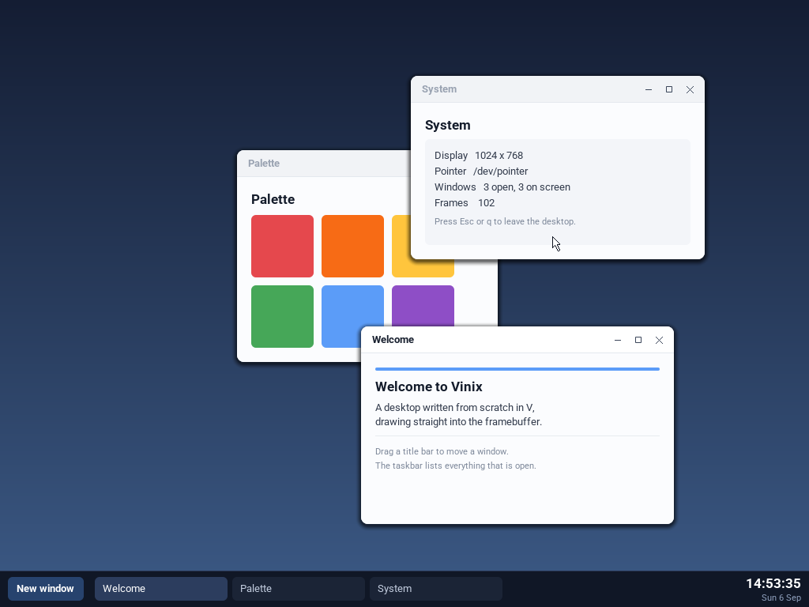
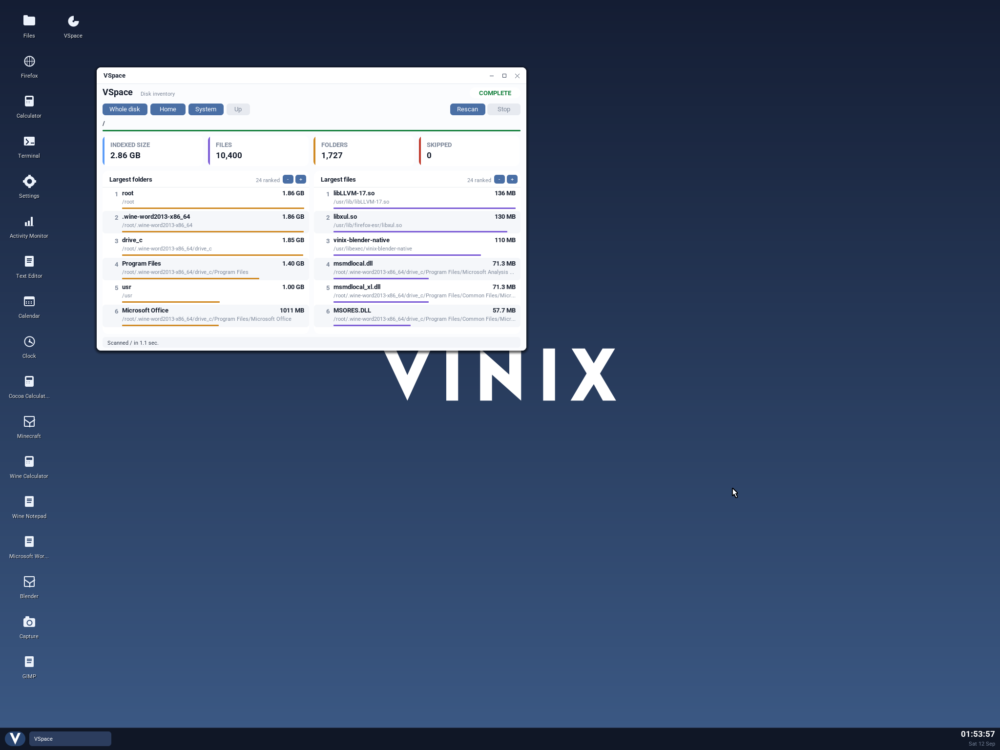

# vinix-desktop

A small desktop environment for Vinix, written in V and built on
[ui2](https://github.com/vlang/ui2)'s declarative element tree.

It maps `/dev/fb0`, reads the pointer from `/dev/pointer` and the keyboard from
its controlling terminal, and composes every frame itself without a display
server or toolkit underneath it. The normal binary is entirely software. An
M1 image that contains the Asahi Mesa runtime also carries a GPU-enabled binary
which uses AGX to present that canvas when `/dev/dri/renderD128`
exists, with an automatic fallback to the static software binary.

The app-by-app comparison with macOS, implemented utility improvements and
the proposed missing utility applications are in [UTILITIES.md](UTILITIES.md).
The application catalog contains 42 entries: 21 native utilities and 21 hosted
or installable integrations.

The window-management comparison with macOS and Windows, implemented gestures
and prioritized remaining gaps are in [WINDOW_EXPERIENCE.md](WINDOW_EXPERIENCE.md).

What it does:

- a wallpaper, and a taskbar with Start, open windows, the desktop build date
  and time, and a clock in its bottom-right status area
- a **Windows 7-style taskbar**: pinned and running buttons that can be
  dragged into a new order, hover thumbnails with a window picker for grouped
  buttons, Aero Peek, a Show Desktop corner (also Super+D), Jump Lists with
  recent folders and documents and per-program tasks, a notification area with
  network, battery, display and Capture icons and an overflow panel, and
  progress bars, badges and attention flashes on buttons
- windows with a title bar, a close, a maximise/restore and a minimise button
- dragging a window by its title bar, with top-edge maximize, side halves,
  corner quarters and a translucent placement preview; shake the title bar to
  hide other windows on its workspace, and shake again to restore them
- four workspaces with a taskbar pager, isolated focus/task lists and
  Super+1..4 switching (Super+Shift+1..4 moves the focused window)
- Linux-style Super+Arrow keyboard tiling into halves and quarters, with
  Super+Up/Down maximizing, restoring and minimizing windows
- resizing a normal window from any edge or corner, with directional cursors
- a taskbar window-overview button and Super+Ctrl+Up thumbnail grid, with
  workspace switching and keyboard selection, including minimized windows
- an arrangement chooser on Super+Z or right-clicking Maximize, with visual
  half/quarter layouts and maximize/restore
- a **V Start button** and Windows 7-style two-column Start menu, with pinned
  and recently used programs, their recent items, Recent Items, All Programs,
  type-to-search, readable paged program/search rows, system links and a
  session button
- **shortcuts down the left edge of the wallpaper**, and matching Start-menu
  entries, for every application the desktop can open
- a **file browser** over the real filesystem: directories first, sizes, and a
  way back up
- an **activity monitor** with searchable process lists, owner/application/
  activity filters, parent/child trees, selectable columns, process inspection
  and termination, suspend/resume and priority controls; CPU/per-core, memory,
  disk, network, GPU submission and battery power histories; configurable
  refresh rates, diagnostic exports, persistent view preferences and per-user
  startup applications
- a **text editor** for plain files, with an editable path, open/save controls,
  undo/redo, Find/Replace, document selection/cut/copy, mouse selection,
  save-aware closing and exclusive Save As
- a **Calculator** with Basic/Scientific modes, DEG/RAD and hyperbolic functions,
  memory, validated numeric paste, bounded calculation history and exact unsigned
  64-bit Programmer mode with four bases and bitwise operations; acknowledged
  result copy to the guest session clipboard
- a **calendar** with month navigation, searchable persistent local events and
  bounded ICS import/export
- **Disk Usage**, a disk usage analyzer: the largest folders and files on the
  machine, ranked and measured while the walk runs, plus filesystem capacity
- a **clock** with local time, a stopwatch with laps and a countdown timer
- **Preview**, an image viewer with zoom, pan, all eight JPEG EXIF orientations,
  manual rotation, rectangular selection/cropping with Undo/Redo and
  PNG/original export
- **Console**, a bounded application-log viewer with tail following, exact
  filtering and matching-row export
- **System Information**, current hardware, storage and installed-package
  reports with localized search, refresh and export
- **Archive Utility**, TAR browsing, creation and safe whole/selected extraction
  with progress/cancel
- **Disk Utility**, read-only block-device and mounted-volume inspection
- **Backup**, versioned local folder copies and restore to a new folder
- **Notes**, searchable local plain-text notes with autosave, text export and
  close confirmation when a final save fails
- **Reminders**, persistent local tasks with due dates, completion and filters
- **Grapher**, bounded mathematical function plots with axes, ranges, saved graph
  documents and CSV export
- **Color Meter**, live screen-colour samples, aperture averages, a magnifier
  and hex/RGB text copy to the guest session clipboard
- **Dictionary**, offline WordNet lookup, suggestions, history, full-definition
  guest clipboard copy and text export
- **Capture**, a native screenshot and screen-recording app with delayed PNG
  screenshots, 5/10 fps AVI recording, automatic self-hiding and live status
- optional **OBS Studio** (`pkg install obs-studio`), hosted in a private X11
  window with a second screen that receives the native compositor image
- a **settings application**: window button side, taskbar style, theme,
  wallpaper, display, battery, experimental M1 Wi-Fi controls and localized
  control search
- **native ui2 applications**: every Files, Calculator, Terminal, Settings and
  utility window is backed by its own OS process, PID and memory accounting
- a **first-run app picker** shown right after the user is created, offering
  Firefox, Chromium, VOffice and Minecraft; the chosen apps install in a
  Terminal window through `pkg`
- optional **VOffice Writer and Calc** (`pkg install voffice`), downloaded from
  the VOffice releases and running as native ui2 clients inside ordinary Vinix
  windows
- a **VT-compatible built-in terminal** with a real PTY, alternate-screen and
  cursor-addressed rendering for editing files in the preinstalled Vim, plus
  UTF-8 output selection and guest clipboard Copy/Cmd-C preserving Ctrl-C
- embedded **Wine Calculator and Notepad**: their translated Win64 processes
  render into private Xvfb displays and are composited as normal Vinix windows
  without hiding the desktop
- embedded **Minecraft**: Mojang's Java Edition client renders into Xvfb and is
  composited as a movable, resizable Vinix window with forwarded input
- **DOOM**: a Chocolate Doom aarch64 SDL2 build renders into a private Xvfb
  display and appears in a movable Vinix window with forwarded input
- native **Blender**: a Vinix GHOST backend renders with surfaceless EGL and
  publishes directly into a compositor-owned Vinix window, with no Xorg or
  Wayland server in the path
- **Cmd-Tab**, which switches windows on the current workspace on a tap and
  shows all of them in the middle of the screen when it is held

Keys: `Ctrl-Q` leaves the desktop, `Ctrl-N` opens a window, `Ctrl-K` the first
application. `Super+Left/Right` tiles, `Super+Up/Down` maximizes or restores,
`Super+1..4` switches workspace and `Super+Shift+1..4` moves the focused
window. `Super+M` minimizes the focused window; `Super+Alt+H` hides/restores
other windows, and `Super+Shift+M` restores the windows hidden by that action.
`Super+Down` also minimizes a floating window after restoring an arranged one.
`Super+Ctrl+Up` opens the overview and `Super+Z` opens the layout chooser.
On Mac keyboards, Super is Command and Alt is Option.
They are chords rather than bare letters because they fire
whenever no application holds the keyboard, which on a machine whose pointer
does not work is most of the time -- and `q` meaning "close the desktop" makes
typing any word with a q in it drop the user back to the console.

## How it fits together

    main.v         the event loop: poll input, rebuild, render, present
    wm.v           the window manager — window list, the ui2 tree, hit routing
    window.v       the Window model and the pages windows show
    workspace.v    four virtual desktops, focus and window migration
    window_shortcuts.v  Super-key tiling and workspace shortcuts
    window_isolation.v  title-bar shake and workspace-local Hide Others
    window_placement.v  pointer half/quarter placement and translucent preview
    window_resize_cursor.v  edge/corner resize cursor shapes and backing bounds
    window_overview.v  paged thumbnail overview and modal keyboard navigation
    window_layout.v    visual arrangement chooser on window chrome and Super+Z
    app.v          native application metadata and factories
    app_process.v  compositor/client IPC, UI-tree encoding and lifecycle
    native_surface_app.v  native external-client lifecycle and input transport
    vinix_surface.v       shared XRGB surface validation and presentation
    files.v        the file browser
    activity.v     the activity monitor, over /dev/processes
    disk_usage.v   the disk inventory: a resumable walk and its two rankings
    editor.v       the plain-text editor and its keyboard editing model
    calendar.v     Gregorian month layout and the calendar application
    clock_app.v    the large clock and stopwatch application
    calculator_app.v / calculator_programmer*.v  arithmetic modes, memory and history
    terminal_selection.v  physical-row selection and Copy/Cmd-C handling
    capture.v      the ui2 capture app, PNG encoder and AVI recorder
    preview_app*.v  the standalone image viewer and export model
    console_app*.v  bounded log snapshots, filtering and tail following
    system_information*.v  system-source inventory and report export
    archive_app*.v  bounded TAR browsing, creation and extraction
    disk_utility*.v  block-device and mounted-volume inspection
    backup_app*.v  versioned folder copies and restore
    notes_app*.v  searchable local notes, autosave and text export
    reminders_app*.v  persistent tasks and local due-state display
    grapher_app*.v  bounded expression parsing, plotting and CSV samples
    color_meter_app.v / color_meter_service.v  colour samples and guest text copy
    native_close.v  save-aware window/session close requests
    clipboard_copy.v  acknowledged text copy to the bounded guest clipboard
    text_copy_client.v  bounded copy snapshots and acknowledgement state
    dictionary_app*.v  offline lookup, suggestions, history and export
    clipboard.v    guest text paste and asynchronous host clipboard requests
    switcher.v     Cmd-Tab: the session it opens and the panel it shows
    taskbar_pin.v / taskbar_drag.v  taskbar pins and dragging buttons into order
    taskbar_preview.v  thumbnails, the window picker, Aero Peek, Show Desktop
    taskbar_status.v   progress, badges and attention reported by applications
    jump_list.v    the taskbar's right-click Jump Lists
    recent_items.v recent documents, folders and programs, and Start menu pins
    notification_area.c.v  the tray: network, battery, display and Capture
    settings.v     preferences shared by the desktop and Settings application
    settings_app.v the settings application
    settings_wifi.v the Wi-Fi pane: radio control, scan and network list
    wallpaper.v    loading and scaling a wallpaper photograph
    backlight_client.v / battery_client.v / wifi_client.v  V device clients
    platform.c.v   V POSIX bindings, terminal state, mmap, clocks and directories
    render.v       a ui2 backend that draws an element tree into a framebuffer
    canvas.v       the software renderer: spans, rounded rects, clipping, blend
    font.v         text, from the coverage atlases in font_data.v
    framebuffer.v  /dev/fb0: geometry over ioctl, pixels over mmap
    gpu_present.v / gpucore/core.v  optional M1 EGL/GLES presenter
    execinfocore/core.v  GCC-unwinder API for panic backtraces
    input.v        /dev/pointer, and the terminal in raw mode
    clock.v        CLOCK_REALTIME and the calendar arithmetic on top of it
    theme.v        every colour and measurement in one place

The interesting part is the split between `wm.v` and `render.v`. The window
manager never draws: it describes the whole screen as a `ui2.Element` tree —
views, labels and buttons with frames, box styles and text styles — and hands
that to the renderer. The renderer paints the tree and, in the same walk,
records every clickable and draggable element's absolute rectangle. Clicks are
routed by hit-testing those records. So what is on screen and what responds to
the pointer come from one description and cannot drift apart.

ui2's element tree is platform independent, which is what makes this possible:
the target has no `gg` or Sokol, so `-d ui2_headless` compiles ui2's
declarative core without its renderer, and this program supplies the renderer
instead. The optional EGL path is a presenter around that renderer rather than
a replacement for its element-tree rasterizer.

Two conventions extend ui2 for this backend, both documented at the top of
`render.v`: an `image_path` of `builtin:<name>` draws a vector glyph the
renderer carries itself, while `asset:<name>` draws one of the bundled,
official 512px QOI app icons; and a rounded view at the top level of the tree
is a floating surface, so it gets a drop shadow and a hairline edge. The
Firefox, Chromium, and Blender sources are recorded in
[`assets/SOURCES.md`](assets/SOURCES.md).

## Native ui2 applications

A ui2 application normally calls `run_vml`, which opens a platform window and
blocks until it closes. Here the desktop *is* the window system, but the app is
still a separate process. The compositor starts `vinix-files`,
`vinix-calculator`, `vinix-terminal`, and the other installed app names with
two private pipes. The app builds a ui2 element tree and sends the
renderer-relevant fields to the compositor; click actions and keyboard input
travel back over the request pipe. Because the compositor supplies the content
size, an app re-lays-out when its window is resized or maximised.

Only the compositor opens the framebuffer, pointer and raw keyboard. All
unrelated descriptors are closed before an app is exec'd, so the app processes
are ordinary display clients rather than competing display owners. Closing a
window first asks whether the app can close, then exits and reaps its process.
A failed final Notes save keeps the draft open until it is saved or explicitly
discarded; ordinary desktop exit also checks every client before closing any.
Settings returns its synchronized preference state with each response,
allowing theme, wallpaper and scale changes to cross the boundary
immediately.

Vinix's own app names are relative symlinks to one static multicall executable.
Each native app has its own address space, and Vinix records the per-app exec
path as its process name. Consequently `/dev/processes` reports truthful CPU
and mapped-memory values for every app. The build uses `VINIX_UI2_SOURCE` when
set, otherwise a sibling `../ui2` checkout when present, and finally
`third_party/ui2`.

VOffice is not built with the image. `../scripts/build-voffice-aarch64.sh` uses
`tools/build_voffice.py` and `tools/ui2_vinix_backend.v` to cross-compile
Writer and Calc as static musl applications from `VINIX_OFFICE_SOURCE`, a
sibling `../office`, or `third_party/office`. It packages both executables with
VOffice's translations and ribbon PNGs as `VOffice-vinix-aarch64.tar.gz` plus a `.sha256`,
and `--publish` uploads them to the latest `vlang/office` release. `--ref=REF`
builds from a clean export of a commit rather than the working tree.
`pkg install voffice` downloads that asset, verifies its checksum and installs
it below `/usr/bin` (`VINIX_VOFFICE_URL` points it at another copy). The
compositor decodes the installed PNG assets itself, so VOffice does not need a
second window system or image service at runtime.
The compositor passes standalone apps their protocol pipes as
`VINIX_REQUEST_FD` and `VINIX_RESPONSE_FD` environment variables, leaving
their command line free for document paths.

The compositor keeps a content-keyed binary in the persistent
`build-aarch64-desktop-apps/` cache, outside the disposable compositor and
initramfs workspace in `build/`. An unchanged deployment reuses it without
invoking the compiler, even after `build/` has been cleaned. Changes to the
desktop source, ui2, compiler or sysroot invalidate the binary. It is replaced
only after a successful compile and link, so an interrupted rebuild does not
destroy the last complete cache entry. Set `VINIX_AARCH64_APP_CACHE` when CI or
an isolated build needs a different cache root.

The separate **iOS Calculator** runs an ARM64 iOS Mach-O through the V
Objective-C/Foundation/UIKit compatibility layer. `./scripts/build-ios-aarch64.sh`
stages its runner and unchanged app bundle; the next desktop build includes
both. It is a standalone display client using the same pipe protocol as
VOffice. See [iOS compatibility](../docs/ios.md) for the supported subset and
QEMU tests.

`./scripts/build-ios-aarch64.sh --with-ppsspp` also stages the official PPSSPP
1.20.4 iOS app and its private Mesa/FreeType runtime. After rebuilding the
desktop, launch **iOS PPSSPP** from Start. Its native main menu and Graphics
settings render in a Vinix window, with mouse input delivered as UIKit touches.
New profiles start with sound disabled; audio is unsupported, and PSP game
execution has not been verified. Its configuration lives under the active
user's `.local/share/vinix/ppsspp/Documents` directory.

The Calculator model comes from ui2's own example and is not copied into this
repository. `tools/stage_app.py` takes it straight from the ui2 checkout at
build time, removes the platform `fn main()` and its now-unused embedded source
constant, and leaves the model and methods unmodified. Vinix's adapter adds
memory, history and Scientific mode. The original VML remains compile-checked
with V3's `$vml` expression. The runtime keypad uses bounded native Element
constructors because current V3 VML child appends deep-clone intermediate
trees without releasing them. Cached literal layouts are reused between
requests and explicitly released on resize/mode changes; the frame borrows
the model's display text. No document parser or expression interpreter runs
in the Calculator process.

The window manager uses reserved prefixes for its own action selectors,
including `taskbar.`, `task.`, `win.`, `shortcut.`, and `start.`. Each rendered
hit target also carries its origin. Compositor selectors are interpreted by the
desktop; selectors supplied by an app remain inside that app's world, even
when their text matches a compositor prefix. The app world's dynamic fallback
routes arbitrary selectors over the private application pipe to the window
that supplied the target, similar to [SBP's star selector](https://github.com/okTurtles/sbp/blob/master/docs/sbp-api.md#sbpselectorsregister).
That is how two copies of an application keep their actions separate: neither
the Calculator's `+` nor the file browser's `files.row.3` needs interpretation
by the window manager.

The compositor has explicit bridges for its own Files context-menu requests.
Run `vinix-desktop --trace-selectors` to log the world and selector of each
high-level pointer action; non-printable and long app ids are redacted.

Add a built-in application by adding an `AppFactory` to `available_apps` in
`app.v`; it then has a wallpaper shortcut and a Start-menu entry.

Firefox is an upstream GTK/X11 application rather than a native ui2 client. It
runs on a private Xvfb display whose live XWD framebuffer is composited into a
normal movable Vinix window. Pointer and keyboard events cross the same compact
input bridge used by the other hosted X11 applications, so the native desktop
and taskbar remain active while Firefox runs. The desktop image builder includes
Xvfb, the input bridge, the direct `startx` launcher, and Firefox's Vinix policy
files. A native error window remains as a runtime fallback when the browser or
X11 layer is missing.
The direct launcher writes Firefox's upstream graphics and GTK diagnostics to
`/var/log/firefox.log`. On an M1 image with the Asahi runtime, direct Xorg can
enable glamor/DRI3 and Firefox WebRender over X11 EGL. The embedded window uses
Xvfb's software surface so the native compositor can copy it into the desktop.

GIMP uses the same hosted X11 path. `pkg install gimp` installs Alpine's native
AArch64/musl build and restores the executable modes for its plug-ins; the
desktop's `run-gimp` launcher disables the unavailable AT-SPI service and opens
GIMP without its splash screen inside a movable Vinix window. Its system
configuration selects the common image-format plug-ins so a first launch stays
within Vinix's current exited-process reclamation limit.

OBS Studio uses the same X11 host, with an additional 1280×900 screen. After
`pkg install obs-studio`, open it from Start and add **Display Capture (XSHM)**
with **Display 1** selected. The compositor writes each presented frame into
that screen's Xvfb framebuffer. Display 0 contains the OBS UI, so the capture
source shows the Vinix desktop. OBS appears in the preview while its window is
visible on that desktop; minimize it to record the other windows alone.

`pkg install minecraft` installs Alpine's OpenJDK 21 and native runtime, then
downloads the newest compatible official Minecraft: Java Edition client from
Mojang's distribution endpoints. The game is never part of this repository or
the default image. For custom preinstalled images,
`scripts/build-minecraft-aarch64.sh` stages OpenJDK 25 and the current release instead.
`/usr/bin/minecraft` starts Mojang's free demo when no account is signed in and
the full game after `minecraft --login`; worlds and options are kept under
`$HOME/.minecraft`. From the
desktop, Minecraft uses the same Xvfb/XWD bridge as translated Wine apps and is
scaled into a native window without surrendering the desktop framebuffer.
Keyboard and pointer events are forwarded into the private X11 display. The
desktop builder picks up a prebuilt layer when present; otherwise its Minecraft
window points to the on-demand package command.

`./scripts/build-doom-aarch64.sh` cross-compiles [Chocolate Doom](https://github.com/chocolate-doom/chocolate-doom)
3.1.1 and stages its SDL2 and SDL2_mixer runtime. It reads the local WAD at
`../3rd/doom/doom1.wad` by default; set `VINIX_DOOM_WAD` to select another
file. The WAD stays in ignored build output and is never committed. Rebuild the
desktop image with `./scripts/build-desktop-aarch64.sh`, then launch **DOOM**
from its desktop shortcut or Start menu. The launcher opens E1M1 in a 720×540
window at the top right, leaving the wallpaper logo visible. The pointer is
hidden over the game content and remains visible over the title bar and other
desktop areas. Its music and sound effects play through the VirtIO sound card
in QEMU (see "Sound in aarch64 QEMU" in the top-level README).
Use W/S to move, A/D to strafe, Q/E to turn, Space to use, and the mouse
button to fire.

Wine Calculator, Wine Notepad, and Microsoft Word 2013 use that same private
Xvfb bridge, so translated Windows programs remain ordinary movable Vinix
windows. Word uses a dedicated translated Win64 prefix; if it is not installed,
the launcher starts staged licensed Word 2013 x64 media or explains how to add it.

Blender does not use that Xvfb bridge. `scripts/build-blender-native-aarch64.sh` applies
the Vinix GHOST backend to Blender 4.3 and stages its executable. The backend
creates a surfaceless EGL pbuffer, publishes completed frames through Vinix's
versioned double-buffered `VSF1` mapping, and consumes compositor pointer and
keyboard records from a pipe. The desktop starts it with only `VINIX_SURFACE_*`
coordinates in its environment; neither `DISPLAY` nor `WAYLAND_DISPLAY` is set.
The on-demand Alpine package continues to supply Blender's shared data and
runtime libraries.

## The file browser

`files.v` is Vinix's own application, and it reads a real
filesystem — the listing comes from the kernel's `getdents64` through musl's
`readdir`, and each entry is `stat`ed for its size. It satisfies the same
`NativeApp` interface in its client process, so the window manager's protocol
proxy knows nothing about files.

Directories sort before files and both sort by name, because the order a
directory is read in is whatever the filesystem happens to store. Clicking a
directory descends, `Up` goes back, and `-`/`+` scroll when there are more
entries than the window has room for.

The image carries the desktop's own source at `/root/desktop`, so there is
something real to browse and so the machine holds the code it is running.

Creating the user on first launch gives it a home, `/home/<user>`, with
`Desktop`, `Documents`, `Downloads`, `Music`, `Pictures` and `Videos` in it.
The desktop surface shows `/home/<user>/Desktop`, and the sidebar's Home and
folder entries open the same folders. Only `/root` is persistent in every
storage layout, so the home is kept in `/root/home/<user>` and
`/home/<user>` is a link to it, made again at every start in case `/home` is
in RAM. Folders the desktop used to keep directly in `/root` move into the
home the first time. Programs still run with `HOME=/root`, so the desktop also
writes `/root/.config/user-dirs.dirs`, which is how Firefox and Chromium find
the Downloads folder.

## Desktop utilities

The text editor reads and writes real files. Click the path in its toolbar to
edit it, press Return or **Open** to load it, and click the document to send
typing back to the page. The usual `Ctrl-N`, `Ctrl-O` and `Ctrl-S` shortcuts
create, open and save; arrows, Home, End, Backspace and Delete move or edit at
the insertion point. Files are limited to 64 KB so one accidental open cannot
consume the desktop on a small system image. New documents default to
`/root/notes.txt`.

The calendar uses the same local offset as the Clock application and lays out a
full six-week Gregorian month. Its arrow buttons cross year boundaries, a day
can be selected for a full date in the footer, and **Today** returns to the
current month. The Clock expands the same local time into an across-the-room
display and adds a start/stop/reset stopwatch with tenth-second updates.

Calculator offers Basic and Scientific modes. Scientific adds square root,
reciprocal, square/cube/cube root, trig/inverse trig, ln/log10/log2/exp and pi/e,
plus sinh/cosh/tanh and their inverses, with selectable DEG/RAD units,
explicit domain/finite errors and 15-significant-digit results. Hyperbolic
functions are independent of the angle units.
Ctrl-S switches mode and Ctrl-D switches angle units in Scientific mode.
Functions use the displayed operand, including a pending binary operation's
right operand. Numeric paste accepts finite exponent notation in Scientific
mode. Memory and repeated equals remain available; click a recent result to
recall it from the bounded 20-entry history.
Nth-root, random and EE entry remain future work. Cube root accepts negative
operands; log2 requires a positive
operand, and cube reports an error when its result is not finite. Copy result
or Ctrl-C copies the displayed number in Basic or Scientific mode, or the
exact selected-base digits in Programmer mode.
Arithmetic errors are not copied. The bounded guest clipboard service reports
success only after acknowledgement; failed or unavailable copies preserve its
previous contents.

Terminal supports mouse selection of UTF-8 cells across physical output rows,
including scrollback and the alternate screen. Drag to select, then choose
Copy or Cmd-C. When input is directed to the shell, Ctrl-C continues to the
PTY for shell/program interrupt handling.
Copy inserts a newline between physical rows and does not reassemble wrapped
logical lines. Changed output or window geometry clears selection. Copies
larger than 64 KiB are refused without truncating or replacing the clipboard.
Wide and combining character cell widths, word/line selection and logical-line
reflow remain future work.
The macOS comparison is [Apple's Terminal shortcut guide](https://support.apple.com/en-bh/guide/terminal/trmlshtcts/mac).

Preview applies all eight JPEG EXIF orientations, including mirrored forms,
without duplicating the decoded image. Fit, pan, manual quarter-turn rotations
and PNG export share the resulting pixel mapping. Choose Select (S), drag over
the displayed image and choose Crop or Enter to keep that rectangle; Pan (P)
restores drag-to-pan, and Clear or Escape removes the selection. Cropping
replaces only the in-memory pixels, preserving alpha and the displayed EXIF/
rotation mapping. Export PNG writes the current cropped/rotated image to a new
path. Original Copy retains the exact cached source bytes and metadata after
cropping, rotation or a later source-file change. Neither export overwrites an
existing path. Undo crop/Ctrl-Z and Redo crop/Ctrl-Y restore the last crop and
its orientation, zoom, pan and selection. A new crop replaces that one history
step; a successful Open clears it, while failed Open/crop preserves it. Longer
undo history, recovery, image resampling and PDF support remain future work.
The macOS comparison is [Apple's image-cropping guide](https://support.apple.com/guide/preview/crop-resize-or-rotate-an-image-prvw2015/mac).
Metadata parsing is bounded, accepts both TIFF byte orders and falls back to
raw orientation for malformed or unsupported records. The format reference is
[CIPA's EXIF specification](https://www.cipa.jp/std/documents/e/DC-X008-Translation-2019-E.pdf).

Calendar's Search field or Ctrl-F searches all stored event titles and locations
with bounded UTF-8 input and case/accent folding. Every query word must match;
results are chronological, with dates and times, and selecting one opens its
actual date and event editor. Paging covers all results. Clear or Escape
returns to the month; editor/interchange drafts keep their own keyboard input.
The comparison is [Apple's Calendar search shortcuts](https://support.apple.com/en-sa/guide/calendar/ical002/mac).

Disk Usage's Filesystem view shows total, used, free and available bytes for the
filesystem containing the scan folder. Rescan refreshes the snapshot; missing
or invalid source data is labelled unavailable. Available excludes reserved
filesystem space. These counters are exported as separate CSV rows from the
logical file-content total, which may include other mounted filesystems.

Grapher's graph-document path is separate from its CSV sample-export path and
defaults to `graph.vgraph` in the canonical home folder. Enter a new absolute
document path and choose Save As to store the current expression and four
x/y bounds. Save As creates a new file and refuses existing files or symbolic
links; choose another name for a later revision. Open or Enter in that path
field validates the whole bounded, versioned document before replacing and
plotting the graph. Failed opens preserve the current fields and plot. Save
changes before opening another
document; Grapher has no autosave or recovery journal. Multiple equations,
3D graphs and PNG/vector export remain separate work. The macOS comparison is
[Apple's graph and equation guide](https://support.apple.com/guide/grapher/create-a-graph-and-add-equations-gcalcd405d09/mac).

Archive Utility browses uncompressed TAR snapshots. Toggle the entry checkboxes
and choose Extract selected to a new folder; selecting a folder also selects
its descendants. Select all and Clear update the choices across all pages.
Extract still extracts the whole archive. Choices are fixed when extraction
starts, while progress and Cancel remain available. Cancelled or failed
extractions retain visibly partial output. ZIP/gzip and other compressed
formats remain unsupported.

System Information searches the collected report rows with a bounded UTF-8
query. Click Search or Ctrl-F and enter words from values, translated labels or
category names; every word must match, with case/accent folding. Matching rows
retain paging, and Escape clears and dismisses search. Refresh recollects data
and reapplies the query; changing language updates translated matches. Report
export includes all collected categories. Device/driver inventory still needs
the corresponding kernel sources; absent data remains labelled unavailable.

Dictionary's Copy definition button or Ctrl-C copies the full headword, a blank
line and the complete unwrapped definition rather than only the visible page.
The total is limited to 64 KiB; oversized entries are refused as a whole.
Copy status distinguishes acknowledged success, failure and an unavailable
guest clipboard service. Copying does not write the host clipboard.

Notes keeps local UTF-8 titles and plain-text bodies with search, debounced
autosave and exclusive text export. If a final save fails, ordinary window
closing or desktop exit keeps the draft open. Keep editing cancels that close
request. Retry Save, export the draft, or choose Discard draft followed by
Confirm discard and retry closing. Forced process termination bypasses the
guard; Notes does not provide a recovery journal.

Color Meter samples the presented desktop in physical framebuffer pixels.
Live follows the pointer every 100 ms; Freeze, Space or Escape holds the
sample. Enter X/Y coordinates and choose Sample (Enter) for a fixed location.
Its 9×9 magnifier shows the selected 1×1, 3×3, 5×5 or 9×9 aperture, and the
RGB value averages its valid pixels. Sampling uses the compositor's saved
cursor backing so the cursor itself does not colour the sample. Copy HEX
(Ctrl-C) or Copy RGB freezes and copies the value into the guest session
clipboard. The default window is 620×540, with full controls at a content size
of at least 584×506. ICC/colour-space conversion, image copy and host clipboard
writing remain separate work; the macOS comparison is
[Apple's Digital Color Meter guide](https://support.apple.com/en-ca/guide/digital-color-meter/welcome/mac).

The optional `tests/desktop-perf/run.py --scenarios=tools` QEMU scenario opens
Color Meter, Calculator and Notes, installs their aliases in older images,
and requires the compositor plus all three native clients. It checks startup
and rendering; utility model/export/ownership tests are documented in
[UTILITIES.md](UTILITIES.md#validation).

Capture is another pure V/ui2 utility. A screenshot can be immediate or delayed
by three or five seconds and is written as `/root/Screenshot-<timestamp>.png`.
Video uses a self-contained, uncompressed AVI writer at either 5 or 10 frames
per second, scales large desktops to at most 640x480 while preserving their
aspect ratio, and writes `/root/Recording-<timestamp>.avi`. Both modes include
the compositor-drawn pointer. The Capture window hides before the first frame;
it returns after a screenshot, while a recording is stopped by restoring its
taskbar entry and pressing **Stop recording**. Closing Capture or leaving the
desktop finalizes an active AVI so the recording remains playable. Audio is not
recorded.

The application process only sends capture requests and renders status. The
compositor owns the pixel stream and writes each frame immediately after it is
presented, so Capture neither opens `/dev/fb0` nor introduces a second display
owner. Its PNG and AVI encoders are implemented in `capture.v` and require no
external image or media library.

Utility windows are sized for the logical MacBook desktop rather than the old
1024×768 QEMU screenshot. Shortcuts fill the available height and flow into a
second column when needed; open-window taskbar entries share the available
space and shrink only as far as a useful title.

## The activity monitor

Activity Monitor lists live processes from `/dev/processes` and reads details
from `/proc`. Click a row to select its PID. The icon-only kill button at the
top left sends SIGKILL and is disabled for init and the monitor itself. The
inspector also offers graceful quit (SIGTERM), suspend/resume, priority changes
and child-first process-tree termination, reporting permission or exit errors.

Search by name or PID, filter applications, your processes, active processes or
root-owned system processes, and switch between a flat list and a parent/child
tree. Matching tree rows keep their ancestors for context. Columns for CPU,
resident memory, PID, parent PID, thread count, accumulated CPU time, user and
state can be selected and sorted. Scrolling and selection follow the PID across
sampling and sorting. Refresh can be paused or set to 0.5, 1, 2 or 5 seconds.

The inspector shows the executable, full arguments, status, memory maps,
private/shared memory, open descriptors and socket targets. Its I/O tab shows
logical file bytes, foreground physical disk bytes and Internet socket payload
bytes with cumulative totals and rates. Export writes a diagnostic report to
the user's home directory through a synced temporary file.

Resources graphs show machine CPU history, per-core CPU history, physical
memory and kernel memory pressure, disk transfers and Internet socket traffic.
The kernel exports cumulative counters; userspace computes differences over
the actual sample interval. A first sample, missing counter, process exit or
counter reset leaves rates unavailable until a valid next sample. CPU load in
the process list is a percentage of one CPU, so multithreaded work can exceed
100 percent. The machine graph is normalized across its cores. Memory in the
list is resident memory; the inspector separately reports mapped space.

The GPU view records accepted driver command submissions and their rate. It
labels hardware utilization, dedicated-memory and power sensors unavailable
until drivers expose them. Energy shows voltage and signed current/power readings
from supported Apple SMC sensors plus battery history; missing sensors and
per-application energy impact are unavailable. Swap and memory compression are
also explicitly unsupported rather than inferred from unrelated counters.

Startup lets each user choose applications for the next desktop session.
`.vinix-startup-apps` stores stable executable names in the user's home;
`.vinix-startup-timings` records the last successful native-app launch handshake
duration. Without a saved configuration, Files and the development Terminal
retain their default startup behavior. Launch latency is separate from CPU
impact, which has not been measured.

The fixed version-1 `/dev/processes` ABI remains unchanged: snapshots are taken
under the process-table lock and contain cumulative CPU nanoseconds and
resident bytes. Additional counters use `/proc/stat`, `/proc/activity_io`,
`/proc/activity_gpu` and `/proc/<pid>/io`; full arguments are retained by exec.
The new counters and job control require booting the rebuilt kernel. Older
kernels still run the app and show unavailable data where appropriate.

`desktop/tools/test-activity.sh` checks the application, controls and allocation
lifetimes. `tests/activity-monitor/run.py` boots architecture-specific syscall,
resource-accounting and repeated-process-read allocation regressions in QEMU.

## Disk Usage, the disk inventory

`disk_usage.v` is a port of the standalone V/ui2 program of the same name — a disk
usage analyzer: four metrics across the top, and below them the largest folders
and the largest files found so far, each row carrying a bar proportional to the
largest entry in its panel. Its accounting is the original's. Symbolic links
are not followed, so nothing is counted twice under a second name and a link
into an ancestor cannot make the walk run forever. A file with several hard
links is counted once. A directory it cannot open is added to **Skipped** and
the scan carries on. A folder's size is its whole subtree, which is what makes
the ranking say where the space went rather than which directory has the most
bytes directly in it.

The interesting part of the port is that the original is threaded and this is
not. The standalone program hands the walk to a worker thread, publishes
snapshots through a mutex and asks its platform window to refresh. A Vinix
application has neither a window nor an event loop of its own: it answers the
compositor's requests and is otherwise not running. So the recursion becomes an
explicit stack of open directories which the compositor advances with the poll
it already sends every 33 ms, one slice of at most 20 ms per poll. The
compositor is blocked while a slice runs, which is exactly what the budget is
for — a scan of the whole disk costs a fraction of each frame instead of a
frozen desktop, and the rankings fill in while it runs as they do natively.

Two questions are asked of every entry: have I been in this directory before,
and have I already counted these bytes under another name. Both are "have I
seen this device and inode", so both are answered by an open-addressed set of
packed 64-bit identities rather than by a keyed map, which would allocate a
string per file on a target with no garbage collector. The rankings keep the
largest two dozen of each kind in order, and anything at or below the floor
that a full ranking sets is rejected without an insertion.

**Whole disk**, **Home** and **System** are the presets; clicking a ranked
folder rescans it, which is how the window answers "and what is inside *that*",
and **Up** comes back out. Folder rows are only clickable once a scan has
finished, because a ranking that is still moving would not be pointing at the
same folder by the time the click arrived. `-` and `+` page a panel when a
ranking holds more than the window has room for.

## The window switcher

`Cmd-Tab` moves to the window under the one on top, and pressing it again goes
back — which is what a tap is for. Holding Cmd down instead asks "what else is
open?", and after 400 ms the desktop answers: a translucent panel in the middle
of the screen with a tile for every window, the selection moving along it on
each further Tab, `Shift` walking back, the arrows moving it too, and the
window it lands on raised when Cmd is let go. A minimised window is in the
panel like any other and comes back rather than being switched to invisibly. A
click on a tile picks it; a click anywhere else puts the panel away.

The delay is the whole of the design. A tap is a gesture people make without
looking, and flashing a panel up for a tenth of a second would only be noise;
a hold is a question, and deserves an answer.

A terminal has no way to say "Cmd", so the keyboard drivers say it for it and
the desktop reads three sequences out of the byte stream before anything else
sees them:

    \e[9;9u        Cmd-Tab
    \e[9;10u       Cmd-Shift-Tab
    \e[57444;1:3u  Cmd let go

The first two are the CSI-u encoding of Tab — the key's own code point, then 1
plus a mask of the modifiers held with it, where super is 8 and shift is 1 —
which is what a terminal that reports modified keys at all uses. The third has
no precedent to follow, because no terminal has ever had a reason to report a
modifier being released; it is the same encoding's left Super key with an event
type of 3, "released". A driver only sends it when a chord was sent while Cmd
was down, so a bare Cmd press still costs a shell nothing.

They are taken out of the stream ahead of the focused application, which is the
one place the desktop overrules whoever is typing: Cmd-Tab belongs to the window
manager on the machine this borrows the gesture from, and a terminal that
swallowed it would strand a keyboard-only session in one window. A sequence
split across two reads is held back rather than handed over in halves — but
only from the second byte on, since a lone escape is a key someone pressed and
delaying it would be felt.

## Settings

Categories down the left, the chosen category's settings on the right.

**Appearance** puts the window buttons at either end of the title bar — right
as Windows does, left as macOS does, with the inner two swapping order to match
each convention — and switches the taskbar between one entry per window, as
Windows XP had, and one per application with a count, as Windows 7 had.

**Theme** chooses between the desktop's own look and *macOS*, matched to a
native 1x AppKit window from macOS Catalina 10.15.7 (19H2): a 22-pixel light
grey title bar, centred title, 12-pixel traffic lights on 20-pixel centres, and
a dock — a rounded panel sized to its contents and centred clear of the bottom
edge — in place of the full-width taskbar. The QEMU captures and measurements
used as the reference live in `docs/catalina-reference/`.

The discs are grey until a window is focused and show their glyphs only while
the pointer is over the set, as macOS does. They also keep red-yellow-green
reading order at whichever end the Appearance setting puts them: that order is
the whole of what makes them recognisable, so reversing it when they move to
the right would defeat the point. Flat buttons have no such signature and
instead put close outermost, which is what both conventions do.

**Wallpaper** offers six colours and ten photographs.

**Display** reports and controls the experimental Apple panel backlight, while
**Battery** reports the Apple SMC battery device. **Wi-Fi** reads the optional
BCM4378 driver, controls its firmware radio, starts scans and lists the networks
found. Firmware loading and network credentials remain in `wifi-ctl`, and the
raw Ethernet device is not an IP stack. See `SETTINGS.md` for the exact device
and hardware limitations.

Settings is the one application that holds a pointer back to the `Desktop`. It
writes preferences straight into it, and since the window manager composes the
whole screen from those preferences on the next frame, a choice takes effect
immediately and everywhere without anything being told to refresh.

Everything that varies between themes is a field of `Theme` in `settings.v`;
anything that does not stays a plain constant in `theme.v`. Application
interiors normally keep their declared styles, but controls marked
`native_style` use Catalina's measured 21-pixel AppKit bezel under the macOS
theme, including hover, pressed, selected, focused and disabled states, and
draw a window's default button white while the window is not focused. Other
controls continue to use their declared `app_*` colours.

## The taskbar

The taskbar follows Windows 7. Buttons are dragged into a new order with the
left button: pins keep theirs in `/root/.vinix-taskbar-pins`, and buttons for
running windows swap per-window ranks. A pinned program that is not running
starts on release, so a press that turns into a drag starts nothing.

Resting on a button for 0.4 s opens a panel of thumbnails of its windows;
clicking a button that stands for several windows opens it at once, as a
picker. Thumbnails are sampled from the composed frame, box-filtered, whenever
a window is fully in view, so a covered or minimized window shows the last
picture taken of it (or its icon until there is one). Resting on a thumbnail
peeks at that window, turning all others into glass outlines, and the strip in
the lower-right corner does the same for the desktop. Clicking it, or Super+D,
minimizes the workspace's windows and a second use puts back exactly those.

A right-click opens the program's Jump List: its recent folders (Files) or
documents (Text Editor), its tasks, such as Files' Documents and Downloads or
Settings' panes, then the program itself, pinning and closing. The programs
record what they open in `/root/.vinix-recent-items`; opening an entry starts a
new window and hands it the path over the ordinary action pipe. The Start menu
shows programs pinned to it (right-click a program), then the most recently
launched ones from `/root/.vinix-recent-programs`, with an arrow beside Files and
Text Editor that shows their recent items in the right column.

The notification area shows the network (the `eth0` address from SIOCGIFADDR,
and the Wi-Fi radio), the battery when there is one, the display's brightness
and Capture, each with a flyout. Right-clicking an icon moves it to or from the
overflow panel behind the chevron; the choice is kept in `/root/.vinix-tray`.

Each application process is started with `VINIX_TASKBAR_STATUS` naming a file
under `/run/vinix-taskbar`. Anything running in that process, including a
shell in Terminal, can write to it:

    progress 42      percent complete
    state paused     normal, paused, error, indeterminate or none
    badge 3          up to three characters
    attention 7      a new serial flashes the button until it is brought up

The compositor reads it once a second and tints the button with the progress,
draws the badge in its corner and turns it orange for attention. Terminal
translates the OSC 9;4 progress sequence and the bell into this file, Disk Usage
reports its walk as indeterminate progress, and a recording Capture window
carries a REC badge.

## Desktop shortcuts

Application shortcuts launch on left-button release rather than press. Moving a
pressed shortcut by six pixels turns the gesture into a drag instead; dropping
it over another shortcut changes the desktop order and writes that order to
`/root/.vinix-shortcut-order`. The persisted file stores stable application
process names, so adding another application does not renumber an existing
layout.

## Wallpapers

Vinix has no JPEG or PNG decoder, and writing one to show a backdrop would be a
strange place to spend the effort. So `tools/fetch_wallpapers.py` downloads the
photographs at build time, decodes them, and writes each as a `.vwp`: a nine
byte header and packed RGB, stored at half the display's resolution and scaled
up when drawn. A photograph survives that at the size a wallpaper is looked at,
and it keeps ten of them to about six megabytes rather than twenty-three.

Downloads are cached, so a rebuild costs nothing and an offline build works
once the cache is warm. With neither network nor cache the build says so and
ships none; the desktop then offers only its colours.

The scaled result is kept in a buffer and blitted, because it only changes when
the setting does. Rescaling three quarters of a million pixels every frame to
paint a backdrop that has not moved would cost more than everything else the
compositor does put together.

The photographs come from [Lorem Picsum](https://picsum.photos), which serves
them from Unsplash under the [Unsplash License](https://unsplash.com/license).
The ids are pinned so a build is reproducible, and each image's source URL is
recorded in `SOURCES.txt` beside it on the image.

## Fonts

Vinix has no font files and no rasteriser, so the glyphs travel inside the
binary. `tools/genfont.py` rasterises several Roboto faces with Noto Sans CJK
SC and Noto Sans JP fallback into 8-bit coverage atlases and writes them to
`font_data.v` as base64; `font.v` decodes them at startup and blends the
coverage, which is the same antialiasing a desktop toolkit would give.
All three fonts use the SIL Open Font License 1.1; see
`FONT-LICENSE.txt` and `FONT-SOURCES.md` for licensing and pinned sources.

Each face is a weight and a pixel size, and the renderer picks the closest one
to what a text style asks for rather than scaling, because a stretched bitmap
atlas looks far worse than one a couple of pixels off. The baked sizes are the
ones the desktop's chrome uses plus those native applications ask for.

Runs are decoded as UTF-8. Beyond printable ASCII each face carries the
supplemental code points in the generator's `EXTRA_RUNES`, plus characters
used by the translation catalogs and native language names. Noto Sans CJK SC
supplies Chinese catalog characters; bundled Noto Sans JP subsets supply
Japanese-only characters. Every face has these glyphs at both display scales,
aligned to Roboto's existing line height. Only the required repertoire is
baked. A missing translation glyph fails generation; an optional candidate
with no real glyph is dropped and reported. Anything not baked draws as a space.

Regenerate after changing a size, a face, or translation characters. The first
run downloads and verifies the pinned Noto source fonts into a host cache:

    python3 desktop/tools/genfont.py

When adding Japanese characters, update the bundled subsets as described in
`fonts/README.md` before regenerating.

Check every catalog character and both raster scales against the baked data:

    python3 desktop/tools/tests/test_font_data.py

## Memory

The target has no garbage collector, and the element tree is rebuilt whenever
the screen changes. Two things keep that from growing the process without
bound: every element id a window needs is built once when the window opens and
reused, and `free_tree` releases each frame's child arrays after it has been
presented. An idle desktop is not recomposed until input or application state
changes.

## Building and running

ui2 is not vendored; check out its current VML version beside the sources,
where the build points V's module path. Compile-time `$vml` also requires a
current V3 compiler; set `V=/path/to/current/v3` when it is not your default:

    git clone https://github.com/vlang/ui2 third_party/ui2

    V=/path/to/current/v3 ./scripts/run-desktop-aarch64.sh

Then, from the repository root, with Homebrew `llvm`, `lld` and `qemu`
installed, one command builds the aarch64 image and boots into the desktop:

    ./scripts/run-desktop-aarch64.sh

Copy text on the host, click a text field in the guest, and press **Ctrl+V**
(or **Ctrl+Shift+V** to explicitly request host text). On macOS, **Cmd+V**
works while QEMU has grabbed input; Ctrl+V also works without the grab. Unicode, tabs and multiple
lines are supported in Terminal, Text Editor and hosted X11 applications such
as Firefox and Wine Notepad. Terminal honors bracketed paste when the shell or
editor enables it. Pasted text bypasses the guest keyboard layout.

After copying in Text Editor, Terminal, Calculator, Dictionary or Color Meter,
**Ctrl+V**, **Cmd+V** and **Shift+Insert** prefer the guest session clipboard.
**Ctrl+Shift+V** always requests the host clipboard instead. Guest copies stay
inside the current desktop session and
do not write the host clipboard.

The aarch64 launcher enables the host clipboard service by default. It reads
the clipboard only when the guest requests a paste, over the existing loopback
host connection. macOS uses `pbpaste`; Linux needs `wl-paste` on Wayland, or
`xclip`/`xsel` on X11. Text is limited to 64 KiB per paste. Pass
`--no-clipboard` or set `VINIX_QEMU_CLIPBOARD=0` to disable it. Sharing requires
QEMU user networking; images booted outside this launcher have no host clipboard
until `/etc/vinix/host-clipboard-url` is configured.

The host runner builds the kernel and packaged desktop with `-prod` and uses
Clang for cross compilation. A warm run reuses cached build outputs. For quick
desktop edits inside the running VM, use `vinix-desktop-build` below.

For Files, Activity Monitor and Settings changes,
`./scripts/cross-compile-app.sh files activity settings` (or `./scripts/cross-compile-files.sh`,
`./scripts/cross-compile-activity.sh`, `./scripts/cross-compile-settings.sh`) builds the
committed desktop sources for AArch64 once and publishes the binary for each
app through the QEMU host source server. The guest checks every two seconds and
atomically replaces `/usr/bin/vinix-files`, `/usr/bin/vinix-activity` or
`/usr/bin/vinix-settings`. Close and reopen the app to run the new version; the
desktop and OS keep running. The guest helper, `vinix-files-sync`, is started
by the desktop image and installed by the runner, so a VM started before an app
was added to it needs one restart before that app syncs. The next boot puts the
packaged app back.

This checkout also provides `.githooks/post-commit`, which runs the script
after commits that change an app's sources (`desktop/files*.v` and the Files
context-menu files, `desktop/activity.v`, or `desktop/settings_*.v`) or whose
subject starts with `Files:`, `Activity Monitor:` or `Settings:`. Enable it in
this checkout with `git config core.hooksPath .githooks`. Set `VINIX_APP_SYNC=0`
for a commit when you need to skip the build, then run `./scripts/cross-compile-app.sh`
later.

To build a single desktop image with the default portable software set
(Python, Ruby, Go, V, developer tools, X11, Firefox, Hyprland, x86 translation,
and the CLI tools), use the aggregate builder and then boot its result. Java,
Minecraft and Wine remain on-demand `pkg` installs instead of taking space in
every image:

    ./scripts/build-all-aarch64.sh
    ./scripts/run-desktop-aarch64.sh --no-desktop

That image supports the complete edit-build-reload loop from its own Terminal.
The files in `/root/desktop` are an editable copy of the exact staged source
set used for the host build, and `/root/vmodules` contains the matching ui2
overlay. A matching system copy under `/usr/share/vinix/desktop-dev` lets the
build helper recover when an older persistent home lacks either tree:

    /root/v-smoke.sh
    vinix-desktop-build

The second command builds `/root/vinix-desktop`, atomically installs it, and
signals the compositor to reload the graphical session. The replacement
session reopens Files and Terminal. The Terminal that ran the build belongs
to the old session and closes during its orderly teardown. `--no-reload`
leaves the current session running. During that teardown its visible rows and
scrollback are saved, so the replacement Terminal restores the command and
build output before reporting the total build and relaunch time in seconds.

On a `gpu+` QEMU boot, the same command reloads into the native TCC-built
software presenter. The `gpu+` indicator returns on the next GPU boot, which
starts the image's GPU-linked desktop again.

The in-guest build uses V3 and native TCC without `-prod`. Compilation stops if
V or TCC fails, without trying the V1 compiler or another C compiler.

For the RAM-system layouts, the runner caches the immutable QEMU image on a
separate ISO9660 disk. Limine loads the uncompressed tar from that disk; the
FAT volume carries EFI and the kernel. When `xorriso` is unavailable,
the runner uses smaller uncompressed FAT modules. `/root` remains on a separate
persistent ext2 volume.

It builds the kernel, builds the desktop, and starts QEMU on the result. The
launcher reuses `boot-image/boot-desktop-qemu-iso.img` for EFI and the kernel,
loads `build/initramfs-desktop-qemu.iso` as the system module, and mounts
`boot-image/desktop-root.ext2` at `/root`. On the first run it derives a
smaller QEMU initramfs from the self-contained hardware image and seeds the
persistent volume with the desktop files and other per-user state. Later runs
reuse those files instead of copying them into another boot image.

Set `VINIX_BOOT_DISK` to manage another long-lived boot disk, or use
`--ephemeral` for a concurrent test whose temporary boot disk and package store
should be deleted automatically. Ephemeral desktop runs seed a private ext2
volume, so they do not share the normal writable desktop volume. Newly created
images below the host temporary directory are also cleaned up automatically; set
`VINIX_KEEP_TEMP_BOOT_DISK=1` only when one must be inspected after shutdown.

    --no-build      boot what is already built
    --no-kernel     skip the kernel build (the desktop is what you changed)
    --no-desktop    skip the desktop build (the kernel is what you changed)
    --monitor       expose a QEMU monitor and QMP socket (see below)
    --no-persist    boot the self-contained RAM-backed desktop image
    --ephemeral     use and automatically delete an isolated boot image
    --replace       stop a VM already using the boot disk

A second VM cannot share the boot disk: QEMU takes a write lock on it and
refuses to start without one. `--replace` stops the one already running.

Anything else is passed through to `scripts/run-aarch64.sh`: `--mem=MB`, `--serial`,
`--virtio-gpu`, and `--virgl`. The latter uses KekVM's Metal/VirGL-enabled
QEMU and Vinix's accelerated VirtIO-GPU render node. The desktop launcher
supplies 8 GiB of guest RAM by default; the immutable system is loaded into
memory while `/root` is backed by the persistent ext2 volume. Use `--mem=MB`
or `VINIX_QEMU_MEM` to override it.

`scripts/build-desktop-aarch64.sh` is the build on its own, if that is all you want. It
translates the V to C, compiles it for `aarch64-linux-musl` against the static
sysroot taken from the userland image, and stages
`build-support/init-aarch64/initramfs-desktop.tar` — an image whose `/sbin/init`
starts the desktop directly. `scripts/run-aarch64.sh` boots any image named by
`VINIX_INITRAMFS`, and with none boots the ordinary shell.

The equivalent amd64 workflow is:

    ./scripts/run-desktop-amd64.sh

It extracts Alpine's prebuilt x86_64 userland and toolchain packages, then
creates a dedicated `vinix-desktop-amd64.iso`; no mlibc or custom GCC bootstrap
is involved. The PS/2 mouse driver publishes the same
absolute `/dev/pointer` ABI as the aarch64 input drivers, so the compositor and
its applications use the same input path on both architectures. Pass
`--no-build` to boot an existing image. Clang cross-compiles the same image on
Apple Silicon, where QEMU runs it with TCG.

An existing `build-aarch64-hyprland/staging` layer remains available without
changing the ordinary desktop session. Produce that layer with
`scripts/build-hyprland-aarch64.sh` on an ARM64 host, then use
`scripts/run-hyprland-aarch64.sh` to select it for that boot; `Super`+`M` exits
Hyprland and returns here.

Options the desktop itself takes:

    --fb=PATH         framebuffer device (default /dev/fb0)
    --pointer=PATH    pointer device (default /dev/pointer)
    --tz=HOURS        hours east of UTC; Vinix has no time zone database
    --frame-ms=N      target milliseconds per frame (default 16)
    --stats           report frame timings to the console

## Driving it from a script

`--monitor` starts the VM with a QEMU monitor and a QMP socket, and the two
tools under `tools/` then drive and photograph it without a human at the
keyboard:

    ./scripts/run-desktop-aarch64.sh --monitor

    python3 desktop/tools/input.py drag 200 90 620 480
    python3 desktop/tools/input.py click 344 412
    ./desktop/tools/screenshot.sh /tmp/shot.png

`input.py` speaks QMP to the virtio tablet, which takes absolute coordinates,
so a click lands where it is aimed regardless of where the cursor was.

First-run setup has its own boot. It types a new user into the registration
screen through the compositor's standard input, chooses apps in the picker that
follows, and checks that the Terminal the desktop then opens runs `pkg install`
for exactly those apps. A recorder stands in for `pkg`, so the boot needs no
network. Guest-init boots need the compact image, which fits the FAT32 boot
disk:

    VINIX_DESKTOP_INITRAMFS=$PWD/build/first-run.tar \
        ./scripts/build-desktop-aarch64.sh --compact-initramfs
    python3 tests/browsers/run_vm.py --first-run --initramfs build/first-run.tar

Setting `VOFFICE_BUNDLE_URL` at the top of `tests/desktop/first-run-apps-init.sh`
installs a real VOffice bundle instead, for example one served from the host at
`http://10.0.2.2:PORT/`, and then opens VOffice Writer from Quick Launch.

## What it needs from the kernel

`/dev/fb0` at 32bpp, and `/dev/pointer` — a character device added for this,
which reports the pointer's position, button levels, the press and release
edges since the last read, and any wheel movement. It never blocks: a
compositor redraws from the latest position anyway, and a queue it drained too
slowly would only make the cursor lag the hardware.

From the keyboard it needs Cmd reported at all, which is new: the console used
to drop the key. All three keyboard paths now track it and send the three
sequences above — `dev/console` for PS/2, `aarch64/virtio_input` for QEMU, and
`apple/spi_keyboard/spicore/core.v` for the built-in keyboard on an M1, where
Cmd is a key someone actually has under a thumb.

It also needs `reboot(2)`. The image's PID 1 supervises the compositor and
restarts it if it exits, reporting its PID and decoded exit status or fatal
signal first. Native-application transport failures report the application's
name, PID and wait status in the same console log. `VINIX_SYSTEM_SESSION=1`
tells the supervised child it owns the system session. `reboot`, `poweroff` and
`halt` sync and signal PID 1 — SIGTERM, SIGUSR2 and SIGUSR1 respectively — rather
than powering the machine down themselves; init forwards that request to the
compositor. The compositor takes it at a frame boundary, closes its applications,
restores the console and only then calls `reboot(2)`, which does not return. The Start menu's
**Shut down** button is the same path. Started from a shell instead of from
init, the desktop is an ordinary process: both then only end the session and
give the console back to that shell, as they always have.

SIGHUP has a distinct meaning: `vinix-desktop-reload` uses it to ask PID 1 for
an orderly compositor replacement. It never reaches `reboot(2)`. On a GPU
system the reload marker deliberately keeps the newly built framebuffer binary
selected for the rest of that boot instead of reverting to the immutable GPU
variant on the next supervisor iteration.

## Native V platform and device code

All handwritten desktop implementations and tests are V. `platform.c.v` is
V source using libc declarations and the target headers for constants and
ABI types; it contains no embedded C implementations. It replaces `shim.h`,
which previously wrapped framebuffer mapping, descriptors, raw terminal mode,
clocks and directory iteration. `backlight_client.v`, `battery_client.v` and
`wifi_client.v` replace the other header-only implementations and provide the
Wi-Fi ioctl client. Device parsers, percentage conversion, retry policies,
state and mocks are ordinary V.

Run `V=/path/to/v sh desktop/tools/test-settings.sh` with the existing
`third_party/ui2` checkout. All client, POSIX and UI tests run; missing V/ui2
is an error, not a silent C-only success. `CLIENTS_ONLY=1` explicitly selects
the portable client/POSIX suite without ui2. See `SETTINGS.md`, `BATTERY.md` and
`../tools/apple-backlight/README.md` for behavior and hardware limitations.
