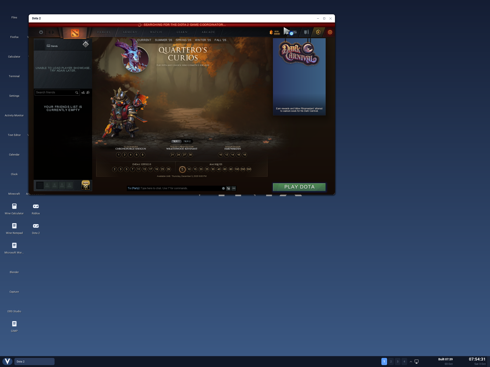
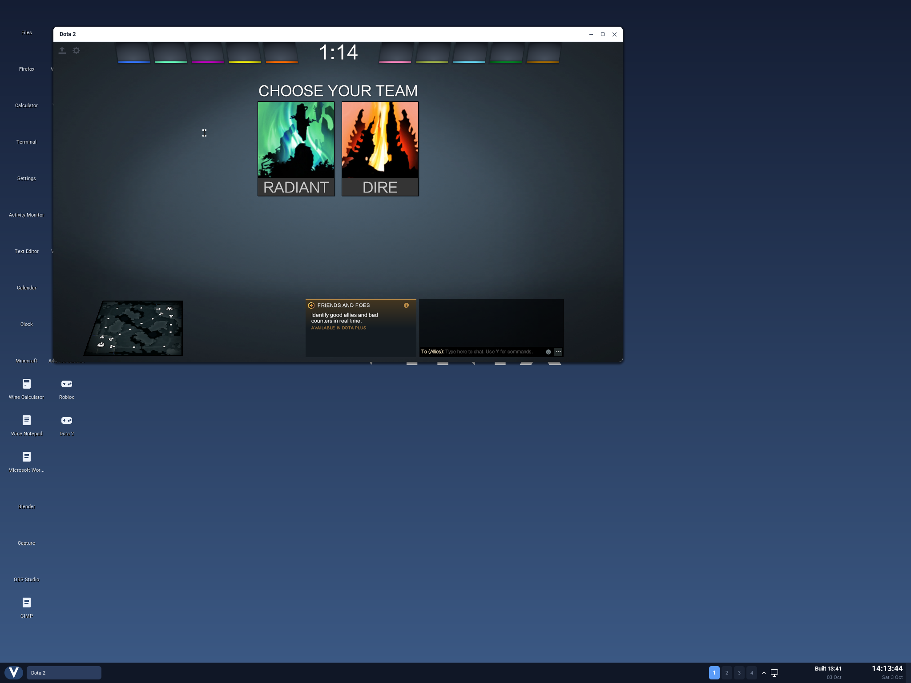

# Dota 2 bring-up

The launcher runs Valve's **Linux x86-64** executable through Vinix's native
QEMU user-mode translator. It uses a private Debian glibc/Vulkan runtime;
the Alpine musl runtime used by Wine cannot load these binaries. Proton is
not needed for the Linux client.

The native Linux client now renders its main menu inside a Vinix desktop
window. In the verified run, mouse input opened the Hotkeys settings and
closed them to return to the menu. A subsequent normal-launch run verified
keyboard input by opening the engine console and typing commands. Loading a
local map first crashed in the Lavapipe Vulkan driver. With the patched driver,
a local map now loads to hero selection, with Dota's own game server running
in the same process. In-match play and online matches have not been verified.
The game probe saves the actual guest framebuffer for inspection.



## Build the runtime and desktop

```sh
./build-steam-aarch64.sh
./build-dota2-aarch64.sh
./build-desktop-aarch64.sh --compact-initramfs --with-dota2
```

The Dota layer contains the launcher, libraries and its patched native
translator. The shared Wine translator staging is unchanged. Supply the full
Linux game installation separately at `/usr/share/games/dota2`, including its `game/`
directory, or set `VINIX_DOTA2_DIR`. Run `run-dota2` on an X11 display or open
**Dota 2** on the desktop. The default window is 1280 by 720; game arguments
are passed through. `VINIX_DOTA2_ROOT` selects another private runtime.

The game also needs Valve's actual Linux Steam client libraries, normally
installed by Steam under `$HOME/.steam/sdk64`, and its `ubuntu12_64/gldriverquery`
helper. The runtime layer supplies their distro dependencies and public TLS
trust bundle; it does not contain a Steam account or Valve's client binaries.
The desktop normally uses `/root` as its home. `VINIX_DOTA2_STEAMCLIENT` selects
another actual Linux64 `steamclient.so`; keep its matching `libtier0_s.so` and
`libvstdlib_s.so` alongside it. The launcher validates the client's ELF
architecture before starting the translator.
The normal launcher keeps Steam's normal authentication behavior. The probe
below explicitly selects the engine's anonymous test mode for local bring-up.

The launcher selects the staged amd64 Lavapipe ICD unless the caller explicitly
selects Vulkan drivers. For that default it also passes Valve's
`-vulkan_allow_cpu` option: the renderer normally excludes CPU adapters from its
device list. An explicit caller driver selection leaves this option to the
caller. Native ARM64 Venus libraries cannot be loaded by the
translated x86-64 process. This software path does not provide the GPU
acceleration used by native OpenGothic.

The staged Lavapipe is rebuilt from Debian's own Mesa 22.3.6 source and
patches, with one [local patch](../build-support/dota2/mesa/README.md) for null
descriptor sets. Only `libvulkan_lvp.so` changes; it links against the runtime's
Debian LLVM 15. `build-dota2-aarch64.sh` cross-builds it with clang, lld, ninja
and pkg-config, and a private Meson. `vulkan-stage.py --debian-lavapipe` keeps
Debian's unpatched driver for baseline comparisons.

The default translated CPU is `Haswell`. In the actual Vinix probe, Mesa
22/LLVM 15 enumerated with QEMU's `max` CPU but aborted at shader compilation
with `64-bit code requested on a subtarget that doesn't support it`. `Haswell`
completed the Vulkan rendering probe. `QEMU_CPU` remains overridable.

Dota's private runtime uses the complete pinned Debian libc6
`2.41-12+deb13u4` package, including its matching loader. The shared Steam
runtime retains its original libc; Mesa 22 and LLVM 15 also stay together.
glibc 2.41 fixes concurrent `getenv` and environment updates
([upstream bug 15607](https://sourceware.org/pipermail/glibc-bugs/2025-July/059702.html)).
On Vinix, the same regression executable terminated with `SIGSEGV` under
glibc 2.36 and completed all 32 rounds under 2.41. Valve's real anonymous
Steam API initialization, callbacks, shutdown and reinitialization also
passed with the new runtime. This fixes that measured runtime failure;
local-map loading still fails separately. The staging cache verifies the
whole libc package and loader aliases. `vulkan-stage.py --keep-steam-libc`
retains the original libc for baseline comparisons.

The launcher passes Valve's `-noassert` option by default. The translated
SteamNetworkingSockets service thread can exceed a debug assertion's lock
wait threshold on this software graphics path; the same assertion occurred
with one and four guest CPUs. This option changes Valve's assertion response
policy, while fatal errors remain active. Set `VINIX_DOTA2_ASSERTS=1` to use
the normal assertion policy.

The launcher enters the Linux ELF directly because Valve's `dota.sh` insists
on the `sniper` distribution. It does not change Vinix's `/etc/os-release`.
Foreign library paths are passed through QEMU's `-E` so the native translator
never attempts to load x86 libraries.

The launcher preloads the existing Bookworm robust-list compatibility library
and the runtime's `libmpg123.so.0` into the translated process. The first
handles QEMU's missing `get_robust_list`; the second prevents Dota's older
bundled decoder from breaking the distro audio dependency's `mpg123_info2`
reference. Caller additions in `VINIX_X86_64_PRELOAD` retain precedence.

The runtime's FreeType is preloaded too. The bundled older FreeType lacks
`FT_Get_Transform`, which the distro HarfBuzz library needs when Panorama loads
its text module. Valve's bundled Pango and PangoFT2 stay together: Panorama
imports `pango_ft2_new_face_substitute`, which current distro PangoFT2 no longer
exports.
Fontconfig uses `/etc/fonts` paths with the private runtime as its sysroot;
including that root in both places makes its configuration load fail.

A guest library preserves x86 `MAP_32BIT` bounds that QEMU 9.1.2 drops
when translating mmap flags. It rejects an impossible 2 GiB reservation,
skips occupied ranges using the translated process's maps, and requests
non-replacing mappings for smaller low-address ranges.

The guest preload `libvinix-dota2-steam-loader.so` opens the actual
Steam client with `RTLD_NOW | RTLD_LOCAL | RTLD_NODELETE` before Source 2 loads.
Without this ordering, Steam's coroutine imports bind partly to Source 2's
different implementation and partly to the SDK, causing assertions and a
startup crash. The early load resolves all eight client coroutine imports to
the actual SDK while preserving the global libc compatibility preloads. It
retains the client for the process lifetime to prevent the measured libnm/GLib
unload and reload failure. A startup marker is consumed before loading the
client, so child helpers skip this early load. Valve's loaded ELF contents and
Steam API implementations remain unchanged.

The Dota translator also checks guest-page collisions under QEMU's existing
mapping lock before handling a partial host page. Without this correction,
QEMU's unreserved mapping path can accept `MAP_FIXED_NOREPLACE` over an existing
4 KiB guest mapping inside a 16 KiB Vinix page and erase its contents. The
contract probe checks both mmap entry points, adjacent guest pages and retained
contents, occupied hints, boundary and overflow cases, fixed mappings, and
large reservations with small holes. The translator build cache can be selected
with `VINIX_DOTA2_QEMU_BUILD_DIR`.

The translator also prepares writable guest data for native `FUTEX_WAKE_OP`
writes when QEMU has protected its shared 16 KiB native page for translated
code. The old translator returned `EFAULT` for a valid writable 4 KiB guest
page in this case. The [paired regression](../tests/dota2/wake-op-README.md)
reproduces that error and verifies 128 successful writes with the fix, with
worker code execution acknowledged after every write. Read-only, inaccessible
and unaligned operands retain their errors; write-only secondary memory
remains supported. This verifies the focused translator fix, without
certifying the separate full futex contract or changing the game-test kernel.

## Reuse an existing installation without another full data copy

Steam's macOS installation supplies the common assets, but its executable is
Mach-O. Obtain the matching Linux depot through Valve's Steam console or
SteamCMD, then overlay it when exporting the assets. In the measured local
installation, public build `25664722` used Linux depot `373306`, manifest
`6617705396435397356`. This was obtainable with anonymous SteamCMD:

```text
login anonymous
download_depot 570 373306 6617705396435397356
quit
```

The manifest must match the installed assets; these identifiers describe the
tested build, rather than a permanent latest version. Keep the source files
unchanged while an export is in use.

The tested depot's seven platform shader archives matched Valve's manifest
hashes. Three library files retained small unmapped trailers after SteamCMD
downloaded two manifests into the same directory; their complete official-length
contents matched Valve byte for byte. No loaded headers or code were patched.

```sh
python3 tools/dota2/ext2_export.py build '/path/to/dota 2 beta' \
    --overlay '/path/to/depot_373306' --state build/dota2/game-export
python3 tests/dota2/export-run.py --source '/path/to/dota 2 beta' \
    --export-state build/dota2/game-export
```

The [read-only exporter](../tools/dota2/README.md) maps file contents into a
virtual ext2 disk served over loopback NBD. The complete local Linux overlay
occupied approximately 121.5 MB of filesystem metadata for 77.58 GB of virtual
disk space. The Vinix proof compares real VPK bytes through both `pread` and
`mmap`, crossing direct and indirect block boundaries, and checks that writes
return `EROFS`.

## Verify graphics before starting the game

```sh
python3 tests/dota2/vulkan-run.py --staging build/dota2-runtime/staging
python3 tests/dota2/launcher-test.py
python3 tests/dota2/export-test.py
```

The Vulkan probe boots Vinix, runs translated `vulkaninfo` and `vkcube` on
Xvfb, and records the kernel, translator, and ICD hashes alongside its serial
log. A successful enumeration alone is insufficient: shader compilation and
presentation must complete too. The Dota probe uses Valve's engine test mode
for anonymous local bring-up and real Steam client libraries; it does not
establish authenticated matchmaking support.

With the early loader, the real Steam API test passes anonymous initialization,
callbacks and clean shutdown even with Source 2's tier0 loaded globally. The
[startup-logo capture](../vinix-dota2-startup-qemu.png) records an earlier
milestone. The main-menu image above is a later, genuine QEMU framebuffer
capture from the full game, including its menu artwork and 3D character.
It was copied without image edits or overlays. Mouse clicks opened and closed
the game's settings in that run. A later run opened the engine console with
the backslash key and accepted typed console commands. This verifies those
keyboard paths; the subsequent local-map attempt crashed before gameplay.

The host export previously disconnected after 120 seconds without a request,
which can occur during shader compilation. It now keeps a negotiated disk
connected until the client disconnects; a real-socket regression checks both
idle reads and the retained handshake timeout. The kernel also now scopes
`fsync` to the descriptor's backing resource: an unrelated failing disk no
longer makes a writable RAM configuration file return `EIO`. The
[native regression](../tests/fsync-scope/README.md) preserves errors and dirty
data on the failing disk.

A further failure was traced to the VirtIO block driver's missing read-only
capability. Although the game disk was mounted read-only, EXT2 saw its backend
as writable. Failed shader-cache writes left a dirty cache page that could
not be evicted. Unrelated inode reads and a demand-paged SDL read then returned
`EIO`, causing a fault at a valid mapped address. The driver now negotiates
VirtIO's read-only feature, exposes that immutable property to EXT2 and returns
`EROFS` before submitting a write. The [native read-only regression](../tests/virtio-ro/README.md)
reproduces the old cache and inode failure, verifies full cache churn and cold
reads with the fix, checks mount aliases and raw writes, and confirms that the
host files remain unchanged.

The earlier main-menu run shown above used four ARM64 guest CPUs, 8 GiB of
guest RAM, Mesa 22/LLVM 15 Lavapipe, the `Haswell` translated CPU and Valve's
anonymous engine mode. It also passed `-noassert` and `-nobreakpad` and loaded a diagnostic
signal observer. It reached the fully drawn menu and accepted the settings
mouse interaction.

The subsequent normal-launch run also rendered the menu, with 16 GiB of guest
RAM and the same four CPUs, kernel, desktop, translator and runtime. It used
the default launcher, without extra diagnostic preloads or `-nobreakpad`;
the only additional game argument was `-console`. The harness still selected
Valve's anonymous engine mode. Keyboard input opened the actual console and
typed commands, as recorded in `console-history-check.png`. The menu reported
that it was searching for the Dota 2 game coordinator, so this is not an
authenticated online-match result.

After `sv_lan 1` and `map dota` were entered into the console, the local-map
attempt exited with status 139 about 650 seconds into the run. No fault
instruction address was captured, so the crash site remains unattributed
pending a diagnostic run. The host exporter served 5,006,002,176 bytes across
290,620 read requests with zero reported read errors. The last guest memory
sample still had more than 5 GiB available and `VinixMemoryPressure: 0`.
The completed harness report is therefore failed despite the separately
verified menu and console input; this crash blocked gameplay.

A subsequent diagnostic launch queued the same local map with the matched
glibc 2.41 runtime. It again exited with status 139. The captured instruction
and complete owning mappings locate this fault in Mesa 22.3.6 Lavapipe's
`handle_compute_descriptor_sets`, at ELF address `0x1f59ff`, source line 1307
in `lvp_execute.c`. The instruction reads `set->layout` from a null descriptor
set (`RDX = 0`, fault address `0x40`). Matching Debian debug symbols confirm
the source location; the graphics descriptor-set handler already checks for
null sets. `VK_EXT_graphics_pipeline_library` makes null sets valid, and the
staged driver now handles them in both paths. On Vinix, the
[paired regression](../tests/dota2/README.md) terminated with `SIGSEGV` under
Debian's driver and an unpatched build from the same source in all three
null-set modes. The patched driver stored through the correct descriptor slot
in all four modes. An earlier candidate that only skipped null sets avoided
one crash but lost the store, because a skipped set moves the sets after it.
This launch served 4,808,656,896
bytes with no exporter errors and retained about 5 GiB of available guest
memory. Its log, captures and failed report are preserved under
`build/dota2/game-glibc241-local-map-test`.

A repeat of that launch with only the driver replaced passed the former crash
point and reached the main menu. Its driver was an earlier build of the same
patched source (`fd5dfbf6...`), differing from the staged build only in
embedded source paths. Its queued `+map dota` ended with Dota's
"Unable to establish a connection with the gameserver" dialog. Typing
`map dota` into the console at the menu then loaded the map: the server
reported one of one players loaded and entered
`DOTA_GAMERULES_STATE_HERO_SELECTION`, and the client showed the
hero-selection screen with the map's minimap. The game was still running when
the 30-minute probe ended, after 5,387,728,896 exported bytes with no read
errors. Inputs and captures, including `hero-selection-01.png`, are under
`build/dota2/game-mesa-null-sets-repeat`.

The runtime staged by `build-dota2-aarch64.sh`, with the committed driver
(`a6a4972d...`), reached the menu about 150 seconds after the game started.
Its first `map dota`, typed as the menu appeared, failed the same way; the
second loaded the map. The client joined the local server over UDP at
`127.0.0.1:27015` and showed the team selection screen below, an unedited
QEMU framebuffer capture. Rendering there is
extremely slow: all four guest CPUs were busy and the pregame timer advanced
about one second per two minutes. The cheat command `dota_start_game` then
crashed the game with a null-pointer read in game code, with that command on
the faulting thread's stack. Captures and inputs are under
`build/dota2/game-product-console-map`.



The first local map of a session failed in all three launches that did not
change network timeouts, including one that waited four minutes at the menu.
A first level load stalls the game loop past the 30-second NetChan timeout of
the client's loopback connection to its own server; during the load the
console reports `timing out, last received ... (10.00 seconds ago)` on both
ends. Entering `cl_timeout 1800` and `sv_timeout 1800` before `map dota` let
the first load connect and reach team selection in about 12 minutes. In the
pregame, frames take seconds to minutes and Dota advances game time by at most
100 ms per frame (`Excessive frame time ... clamped`). `sv_cheats 1` and
`host_timescale 10` make its timers usable; `jointeam good` joins Radiant.

Committing a hero then crashed every time: clicking LOCK IN on Io, RANDOM, and
`dota_start_game` each ended with `SIGSEGV` at the same code in Valve's
`libserver.so`. The library is loaded as an anonymous mapping, matched by its
text segment size, at a bias of `0x3aec000` below the mapping; that bias puts a
`call rax` right before the faulting thread's return address. The function
updates `CDOTA_PlayerResource` team slots and fires `dota_player_team_changed`.
It calls through the vtable of an object it was passed, and that vtable pointer
was zero in one crash and pointed into heap data in the others. Joining a team
through the same path did not crash. The player in this probe is Valve's
anonymous engine test mode, without a Steam account or Game Coordinator
session, and the cause is not established. The kernel's partial-page
`madvise`, which could have cleared live neighbours of a discarded 4 KiB guest
page, clears only the requested range. Gameplay therefore still stops at hero
selection. Inputs, captures and fault reports are under
`build/dota2/game-product-small-window` and `build/dota2/game-product-pick-hero`.

One otherwise identical launch ended at startup with
`QEMU internal SIGSEGV {code=MAPERR, addr=0x8005334e890}`, a fault in the
translator itself; the repeat did not reproduce it. The translator now also
reports the host PC and frame chain for such faults.

The tested artifacts are recorded below. The runtime value is its build-input
generation fingerprint; the other values are SHA-256 hashes of the binaries.

| Artifact | Tested hash or generation |
| --- | --- |
| ARM64 SMP kernel | `63ed08e26058355f4c0f02e9d1cee06fe1ef82f43b405a9350bbd331b3c28ac0` |
| Vinix desktop | `140ce22b1f6a4ffe4399e7b7fe8905558efb2553f2d512defce67e6f87ace79e` |
| Native QEMU translator | `d41f4ed1eb30cd11ced87c436502852df1c1762b9049c1b771a7105e4613e54b` |
| Private Dota runtime generation | `58be6e668672138ad07cd3e67104019473a6a5eef62734daf09d697641c0ed52` |
| Normal-run launcher | `4dfeee16e0e8f83d0df1f40cd2d41bae1771cb3889dbaf2aeaecec86d7f92f21` |

The 8 GiB run encountered guest memory pressure while loading the menu.
The verified 16 GiB run had about 8 GiB available when the menu appeared and
reported `VinixMemoryPressure: 0`. Use 16 GiB if the host has enough memory.
Software translation and Lavapipe make startup and interaction slow. A
rendered menu and working console do not establish playable frame rates,
in-match controls or online support.

After the file and graphics probes, capture the real game:

```sh
python3 tests/dota2/run.py \
    --base-root build/dota2-vulkan/test/root \
    --translator-staging build/dota2-runtime/staging \
    --desktop build/vinix-desktop \
    --export-state build/dota2/game-export \
    --steamclient /path/to/Steam/steamrt64 \
    --gldriverquery /path/to/Steam/ubuntu12_64/gldriverquery \
    --memory-mib=16384 --timeout=1200 \
    --extra-game-arg=-console
```

`--steamclient` supplies Valve's Linux `steamclient.so`, `libtier0_s.so`,
and `libvstdlib_s.so`, and `--gldriverquery` supplies the real Linux helper;
if an actual Linux64 `vulkandriverquery` is present beside the supplied GL
helper, the probe validates and copies it too, recording its hash. The probe
never copies an account profile. Its private boot moves the
read-only game mount from `/root` to the game directory and
leaves both the desktop's and game's settings in writable RAM. Captures and
serial output are saved under `build/dota2/game-test`. The report requires
visual review: an engine crash or the desktop's launch/error placeholder is
not evidence that the game rendered.

The earlier run's logs and separate visual review are under
`build/dota2/game-ro-fixed-test`. The normal-launch run's captures and
`visual-review.json` are under `build/dota2/game-normal-launch-test`;
`results.json` records its failed local-map attempt. The keyboard proof
is `console-history-check.png`, with input actions in `interaction-log.jsonl`.
The immutable kernel is under
`build/dota2-virtio-ro/kernel-aarch64-smp`, its desktop is under
`build/dota2-ui-integration/pins/140ce22b1f6a4ffe4399e7b7fe8905558efb2553f2d512defce67e6f87ace79e`,
and its translator staging is `build/dota2-qemu/staging`. Supply those paths
with `--kernel-dir`, `--desktop` and `--translator-staging` to use the tested
artifacts locally; `--host-source` should select `vinix-wine-host.c` from the
same desktop pin. The probe's automatic report deliberately leaves
`rendering_verified` false until a human reviews the captures. The separate
visual reviews record the confirmed menu, settings mouse interaction and
limited console keyboard evidence.
