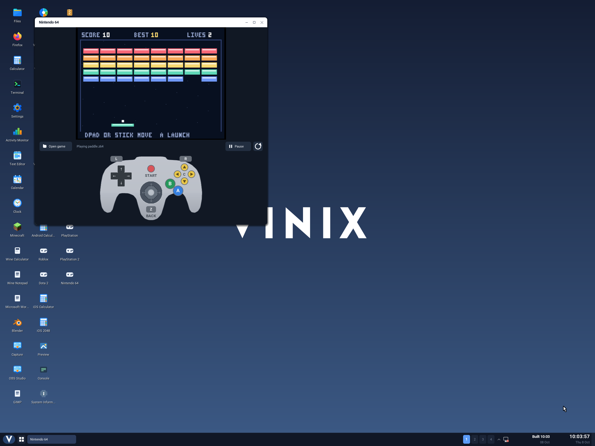
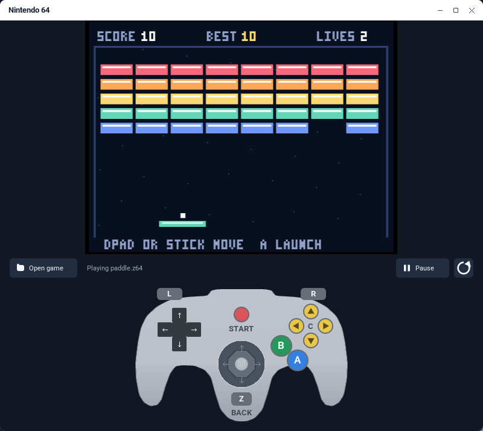
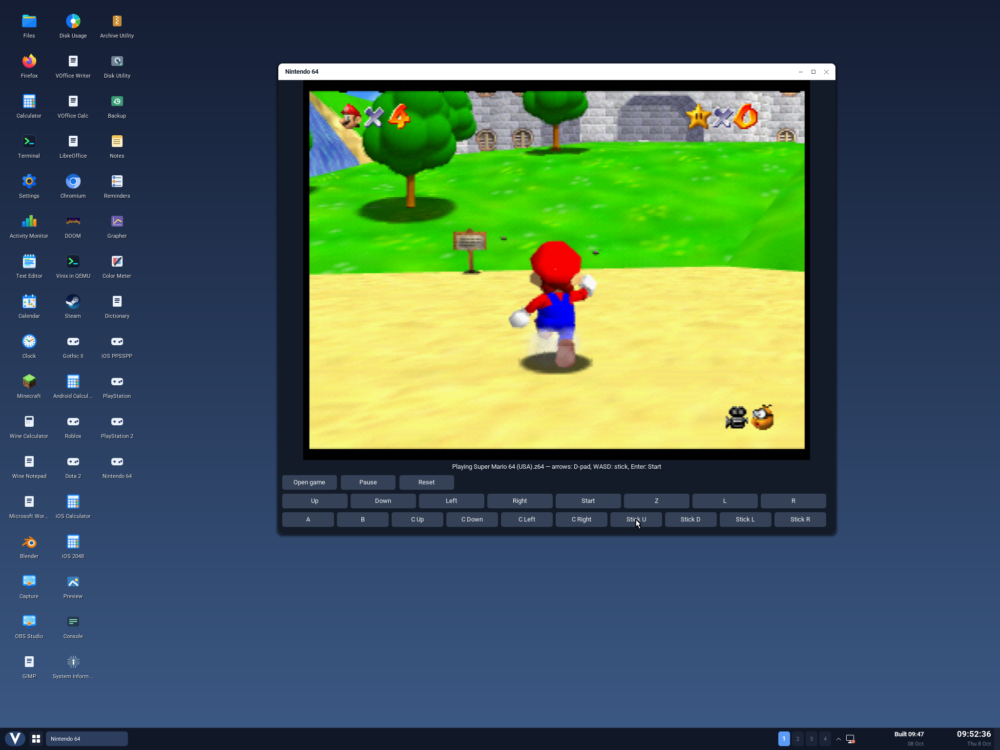

# Nintendo 64 on ARM64 Vinix

The **Nintendo 64** desktop app runs a native, static build of
[paraLLEl-N64](https://github.com/libretro/parallel-n64) with an interpreter,
the low-level RSP, and Angrylion's software renderer. The V frontend publishes
the emulated framebuffer through Vinix's shared surface protocol and sends
stereo audio to `/dev/dsp` at the rate reported by the emulator.

The included **Paddle** cartridge is redistributable homebrew built from
source. It runs actual N64 MIPS instructions, clears the framebuffer through
RDP commands, draws the game, reads the controller through SI/PIF, and stores its score in
cartridge SRAM. Press **Start** or Enter, then move the paddle with Left/Right
or A/D to keep the ball in play and clear the bricks.



## Build and launch

With the existing ARM64 musl userland installed:

```sh
./scripts/build-n64-aarch64.sh
./scripts/build-desktop-aarch64.sh
./scripts/run-aarch64.sh --desktop --no-build
```

Open **Nintendo 64** from the desktop. **Open game** accepts an absolute path
to an uncompressed `.z64`, `.v64`, or `.n64` cartridge file. The executable also
accepts a startup path:

```sh
vinix-n64 [--mute] [game.z64]
```

Launch the frontend through the desktop, which supplies its IPC descriptors.
The regression harness supplies those descriptors when testing it in isolation.
Normal cartridge games do not need an external BIOS. Commercial ROMs are not
downloaded or bundled.

| Keyboard | N64 control |
| --- | --- |
| Arrows | D-pad |
| WASD | Analog stick at full deflection |
| Z / X | A / B |
| C | Z trigger |
| Enter | Start |
| Q / E | L / R |
| I / K / J / L | C Up / Down / Left / Right |
| P or Escape | Pause / Resume |

The on-screen controls follow the original gray controller: three grips, a
D-pad on the left, a central stick, blue A and green B buttons, a yellow
C-button diamond, and red Start. L/R sit on the shoulders; the Z trigger is
shown below the stick with a **BACK** caption so it remains accessible.
Buttons highlight while held, and hovering shows their keyboard shortcuts.
Drag the stick from its center to move; releasing it returns it to neutral.
Stick input uses full deflection, including diagonals. Dragging away from a
digital button releases it. The layout shrinks for short windows.



**Pause** freezes emulation and the circular-arrow **Reset** restarts the cartridge.
Opening a path pauses the game temporarily; Escape restores the previous pause
state. Invalid cartridge requests preserve the loaded game.

## Saves and compatibility

Each game path gets a save file under `~/.local/share/vinix/n64/saves`. The
emulator's packed save memory includes EEPROM, SRAM, FlashRAM and controller
paks. Saves are flushed periodically, on reset, on cartridge changes, and on
clean close. `VINIX_N64_DATA` overrides the data root; `VINIX_USER_HOME` selects
the active user's home.

This first port uses an interpreter and software rendering. Expect limited
speed, and assess compatibility for each game. The homebrew regression does
not establish compatibility with a particular commercial cartridge. There is
one controller; physical gamepads and proportional analog input are future
work. This frontend accepts cartridges rather than 64DD disks or archives.

`VINIX_N64_BUILD_DIR` selects the build output (default `build/n64`), and
`VINIX_N64_STAGING` selects the optional layer incorporated into the desktop
image. Use `--without-homebrew` to omit the game, or `--core-only` to build
the emulator library without compiling the frontend. Pinned inputs and license
details are in [the build guide](../build-support/n64/README.md).

## Super Mario 64 (USA)

The user-supplied `Super Mario 64 (USA).z64` was verified on ARM64 Vinix in
QEMU on 2026-10-08 with the existing interpreter and software renderer. The
desktop run reached the title screen, file selection, opening cutscene and
castle grounds. Actual pointer input on the app's Start, A and analog-stick
controls started the game and made Mario run. Resizing the window, freezing
the game with Pause, resuming animation and closing cleanly also worked.
No emulator changes were needed for this cartridge.



The supplied cartridge is 8,388,608 bytes, SHA-256
`17ce077343c6133f8c9f2d6d6d9a4ab62c8cd2aa57c40aea1f490b4c8bb21d91`.
The guest regression passed all ten homebrew checks and the optional
supplied-game check, which rendered 1,153 quantized frame colors and shut
down cleanly. This establishes startup and sampled gameplay for this ROM;
it does not establish full-game compatibility or real-time performance.
The ROM remains local and is not bundled with Vinix.

## Regression

```sh
python3 tests/n64/run.py --no-build
python3 tests/n64/desktop.py --desktop build/n64/vinix-desktop
```

The guest regression checks changing frames, controller input at equal
emulated ages, pause/resume, reset, rejected cartridge handling, saves across
a fresh process, and surface cleanup. The desktop regression uses actual QEMU
pointer events to start and play the game, pause/resume, and close its window.
See [the regression guide](../tests/n64/README.md) for commands and artifacts.

The ARM64 Vinix guest and desktop regressions passed in QEMU on 2026-10-07.
The guest verified 28 frame colors, an RDP-rendered background, animated game
pixels, equal-age D-pad and stick effects, batched keyboard input, persistent
SRAM, all three ROM byte orders, and recovery from stalled CPU boot code.
An independent native RSP regression verified that malformed branches in
delay slots hit the instruction limit and a subsequent task can run.
The desktop test verified real pointer input, paddle movement, pause/resume
and clean close. The additional Super Mario 64 verification is documented above.

The controller redesign passed the guest and desktop regressions again on
2026-10-08. The guest checked every controller button, colors and C-direction
symbols at both 800×680 and 400×300, digital drag release, and stick capture
and release. The desktop test also dragged from the stick's neutral center
outside its well and verified paddle movement. The Paddle screenshots above
show the new controls in the actual Vinix desktop.
