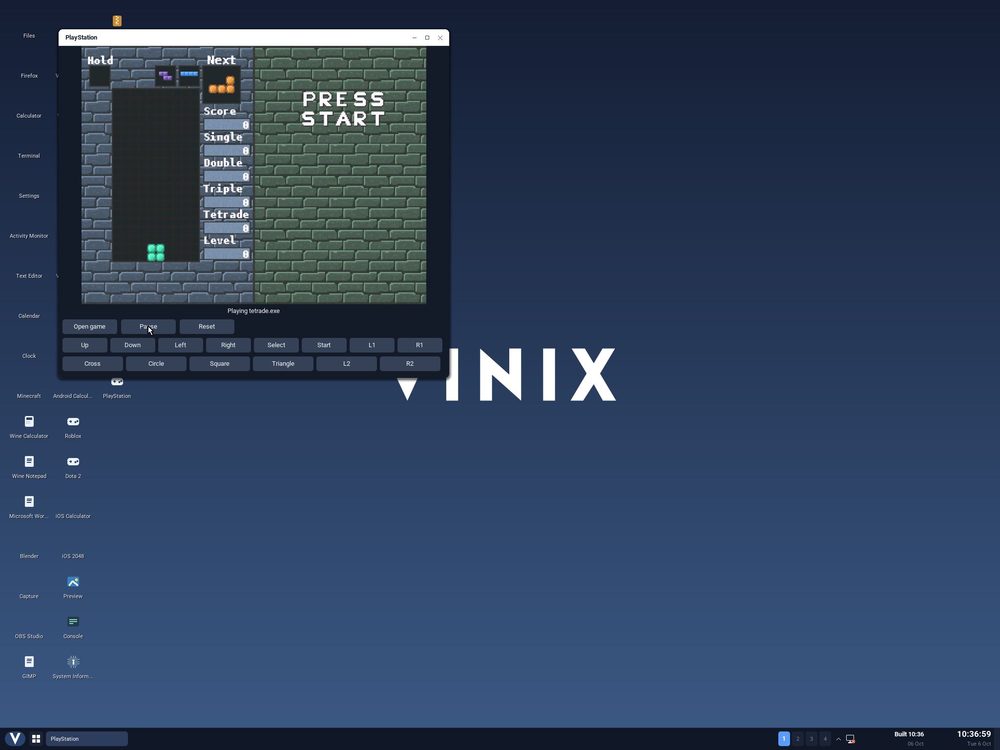
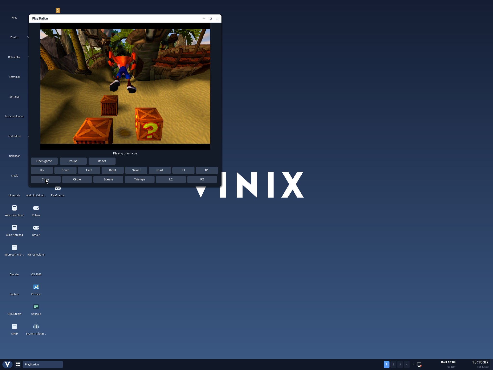

# PlayStation games on ARM64 Vinix

The **PlayStation** desktop app runs PS1 games through the unchanged
[PCSX-ReARMed libretro core](https://github.com/libretro/pcsx_rearmed).
Its native V frontend sends the emulator's actual framebuffer to the existing
Vinix compositor, handles controller input, and saves memory cards. The default
build includes [Tetrade 1.0](https://github.com/Logan-Campbell/Tetrade/releases/tag/v1.0),
Logan Campbell's MIT-licensed PS1 Tetris game. Its original MIPS executable,
graphics and sound assets are downloaded without rewriting them.



## Build and play

After building the ARM64 userland sysroot:

```sh
./scripts/build-ps1-aarch64.sh
./scripts/build-desktop-aarch64.sh
./scripts/run-desktop-aarch64.sh --no-build
```

For a smaller image, use the compact desktop build. This example creates a
separate image and boots an isolated session; its memory cards last for that
session:

```sh
VINIX_DESKTOP_INITRAMFS="$PWD/build/ps1/initramfs-desktop.tar" \
  ./scripts/build-desktop-aarch64.sh --compact-initramfs --without-firefox
VINIX_DESKTOP_INITRAMFS="$PWD/build/ps1/initramfs-desktop.tar" \
  ./scripts/run-desktop-aarch64.sh --no-build --no-persist --ephemeral
```

Open **PlayStation** from the desktop. Tetrade starts on its title screen;
press **Start**, then **Cross** to select Marathon. The game counts down before
the first piece falls. **Open game** accepts a path to another game: type or
paste the path, then press Enter. Escape cancels opening. **Pause/Resume**
stops/restarts emulation; **Reset** restarts the current game.

| Keyboard | PS1 control |
| --- | --- |
| Arrow keys or WASD | D-pad |
| Z / X / C / V | Cross / Circle / Square / Triangle |
| Enter / Tab | Start / Select |
| Q / E | L1 / R1 |
| 1 / 3 | L2 / R2 |
| P or Escape | Pause / Resume |

The on-screen controller buttons can be held with the mouse. Keyboard input
uses short button pulses through Vinix's existing text-key protocol. The
frontend currently exposes one standard digital controller.

`vinix-ps1 [--mute] [game file]` also accepts a startup file when launched with
the desktop's application pipes. The core accepts CUE/BIN, CHD, PBP, ISO, M3U
and PS-X EXE files; retain CUE sheets, playlists and their referenced files
together. M3U starts its selected first disc; disc swapping has no frontend
control yet.

## BIOS, memory cards and build inputs

The included game runs with the core's HLE BIOS. Place an appropriate BIOS
under the active user's `~/.local/share/vinix/ps1/bios` for games that require
one. The [upstream BIOS documentation](https://docs.libretro.com/library/pcsx_rearmed/#bios)
lists supported filenames and compatibility limits. Memory cards live under
`~/.local/share/vinix/ps1/saves`; each game path gets a separate 128 KiB card.
The frontend restores it on load and replaces it atomically every 300 frames,
on reset/game change, and during normal window close.

`VINIX_PS1_DATA` selects another data root. `VINIX_PS1_BUILD_DIR` and
`VINIX_PS1_STAGING` select the build output and desktop staging directories.
`--without-homebrew` omits Tetrade. Core sources and homebrew binaries remain
in ignored `build/ps1/`; download hashes, pinned revisions and licenses are
documented in [the build inputs](../build-support/ps1/README.md). The static
ARM64 executable uses musl, the MIPS interpreter and the NEON software GPU;
it requires no X11, Mesa or iOS runtime changes.

Game speed follows the desktop's polling cadence; real-time performance across
other games is unmeasured. Audio is submitted to Vinix's nonblocking OSS device
when available; the regression uses `--mute` and does not verify sound output.
Crash Bandicoot (USA, SCUS-94900) was verified in N. Sanity Beach with
the HLE BIOS. Other commercial games and analog controllers have not been tested.

## Verification

```sh
python3 tests/ps1/run.py --no-build --game build/ps1/homebrew/TETRADE_PSX.cue
python3 tests/ps1/frame.py build/ps1/qemu.log build/ps1/gameplay.png
python3 tests/ps1/desktop.py
```

The isolated ARM64 Vinix guest executes Tetrade's original PS1 instructions
through the real emulator. It checks detailed game pixels and animation,
compares neutral/controller-input frames at identical emulated ages, verifies
pause/resume and deterministic reset, and checks memory-card persistence
across processes. Closing must exit successfully and unlink the shared surface.
The additional CUE/BIN run verifies the core's disc loader. See
[the regression guide](../tests/ps1/README.md) for supplied-game and BIOS options.

Verified in ARM64 QEMU on 2026-10-06: 1,920 changed game pixels across an
animation sample and 1,408 changed pixels after Right at an identical emulated
age. Both the original EXE and CUE/BIN disc boot passed. A separate desktop
test uses real mouse clicks to start Marathon, freezes the displayed game
through Pause, resumes its falling pieces, and closes the window cleanly.
Its native screenshot is above; its transcript is `build/ps1/desktop.log`.

The iOS regression also passes with calculator, 2048, C++/UIKit/GLES fixtures
and the unchanged PPSSPP iOS binary executing the PSP cube demo.

The supplied Crash Bandicoot USA CUE/BIN was also verified on 2026-10-06.
The trial reached its title menu, island map and N. Sanity Beach, then tested
forward movement, jumping and spinning away the three starting crates.
Pause froze every game pixel for 60 poll frames; resuming changed 17,654 pixels
after 120 frames. The emulator and isolated QEMU guest shut down cleanly.
Its captured frames, input sequence and serial log are retained under
`build/ps1/crash-smoke/`. This trial used the same native executable and
unchanged core with the HLE BIOS.

A separate desktop trial opened the supplied disc through **Open game**,
using actual mouse and keyboard input. It reached the same level, moved and
jumped with the on-screen controller, and cleared the remaining crate with
the keyboard's Square binding. Pause kept every displayed game pixel
unchanged; Resume continued gameplay, and normal window close shut down
the emulator successfully. Its screenshots, input sequence and serial log
are under `build/ps1/crash-desktop/`.


