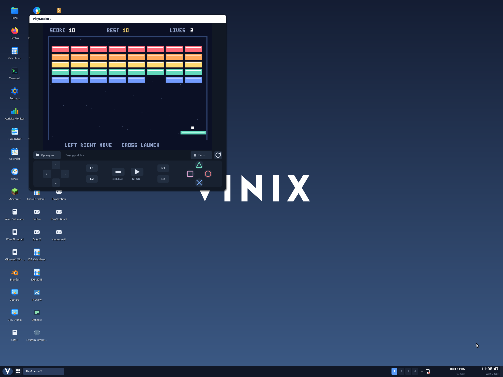

# PlayStation 2 on ARM64 Vinix

The **PlayStation 2** desktop app runs a native build of
[Iris](https://github.com/allkern/iris) with the EE and IOP interpreters and
software GS renderer. The V frontend sends the original emulated framebuffer
to Vinix's compositor through a double-buffered shared surface, and sends
stereo SPU2 audio to `/dev/dsp` at 48 kHz.

The included **Paddle** game is a small, redistributable PS2 homebrew game.
It executes real R5900 and IOP instructions, draws through the PS2's GIF/GS,
and reads the emulated DualShock through SIO2. It starts without Sony firmware.
Press **Start** or Enter, then use Left/Right or A/D to keep the ball in play
and clear the bricks.



## Build and launch

With the existing ARM64 musl userland installed:

```sh
./scripts/build-ps2-aarch64.sh
./scripts/build-desktop-aarch64.sh
./scripts/run-aarch64.sh --desktop --no-build
```

Open **PlayStation 2** from the desktop. **Open game** accepts an absolute path
to a PS2 ISO or ELF. The executable also accepts a startup path:

```sh
vinix-ps2 [--mute] [--bios=/path/to/ps2.bin] [game.iso or game.elf]
```

The frontend expects the desktop's IPC descriptors, so launch it through the
desktop. The regression harness supplies those descriptors for isolated tests.

| Keyboard | PS2 control |
| --- | --- |
| Arrows or WASD | D-pad |
| Z / X / C / V | Cross / Circle / Square / Triangle |
| Enter / Tab | Start / Select |
| Q / E | L1 / R1 |
| 1 / 3 | L2 / R2 |
| P or Escape | Pause / Resume |

The on-screen controller uses the PlayStation's colored Cross, Circle,
Square and Triangle symbols in their controller arrangement, with a D-pad,
Select/Start and shoulder buttons. Hovering shows the keyboard shortcut;
buttons highlight while held, and dragging away releases them. **Pause**
freezes emulation; the circular-arrow **Reset** button boots the current game
again. Opening a path temporarily pauses the game; Escape cancels and restores
the previous pause state.

## BIOS, cards and compatibility

For disc games and ordinary PS2 ELF programs, supply a BIOS dump from your
console at `~/.local/share/vinix/ps2/bios/ps2.bin`, or select one with
`--bios=PATH`. Sony firmware and commercial games are not bundled. The included
bare-metal game identifies itself with a private ELF OSABI and bypasses BIOS
boot; ordinary games follow the emulator's BIOS boot path.

Each game path gets its own card under `~/.local/share/vinix/ps2/saves`.
Cards are flushed on periodic updates, reset, game changes, and clean close.
`VINIX_PS2_DATA` overrides the data root. `VINIX_USER_HOME` selects the active
user's home, as it does for the PS1 frontend.

This first port uses an interpreter and an older software-rendering Iris
revision. Expect low frame rates and incomplete game compatibility. Rendering
the homebrew successfully does not establish compatibility with a particular
commercial game. There is currently one digital controller; analog sticks,
physical gamepads, and accelerated rendering are future work.

`VINIX_PS2_BUILD_DIR` selects the ignored build output (default `build/ps2`),
and `VINIX_PS2_STAGING` selects the layer incorporated into the desktop image.
Use `--without-homebrew` to omit the game, or `--core-only` to build the emulator
library and stage its inputs without compiling the frontend. Pinned sources,
archive hashes, and license details are in
[the build guide](../build-support/ps2/README.md).

## Regression

```sh
python3 tests/ps2/run.py --no-build
python3 tests/ps2/frame.py build/ps2/qemu.log build/ps2/paddle.png
python3 tests/ps2/desktop.py
```

The native guest regression runs the PS2 program and verifies changing frames,
controller effects at equal emulated ages, pause/resume, deterministic reset,
memory card persistence, and surface cleanup. See
[the regression guide](../tests/ps2/README.md) for supplied-game options.

The desktop test accepts another compositor containing the PS2 catalog entry
with `--desktop`. Development validation used an isolated build at
`build/ps2/vinix-desktop`.

Both regressions passed on ARM64 Vinix in QEMU on 2026-10-07. The guest produced
eleven frame colors, 410 animated pixels, and 1,758 pixels changed by input at
equal emulated ages and verified the controller's four symbol buttons. The
desktop test verified real pointer input through the controller layout, paddle
movement, pause/resume, and window close; its screenshot is above. BIOS-backed
commercial games have not been validated in this port.
