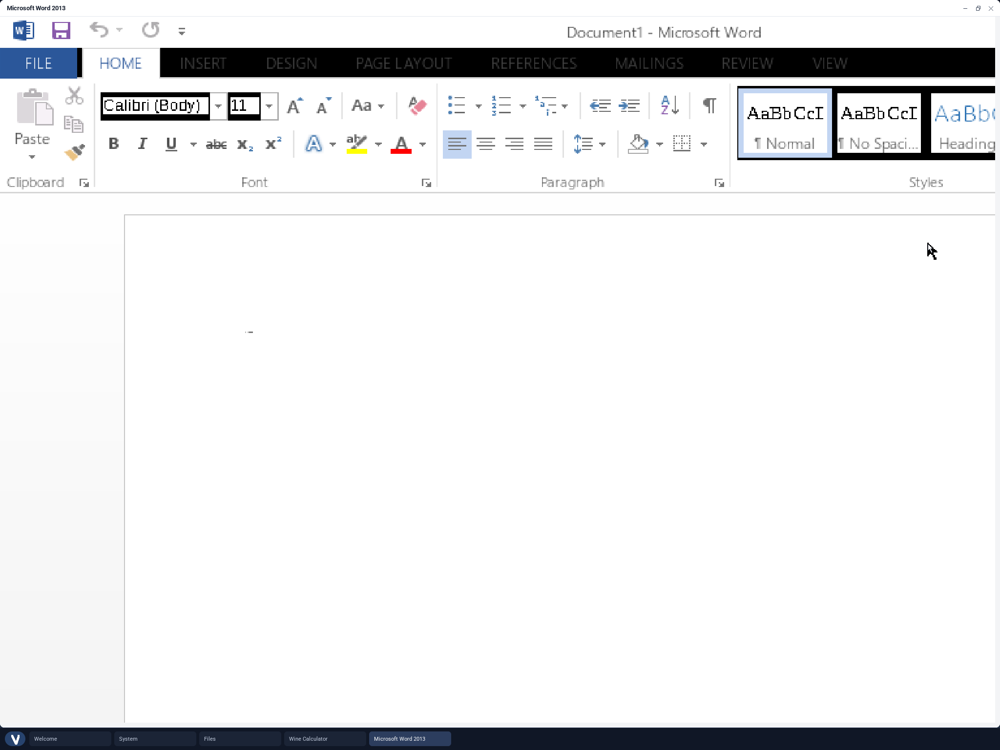

# Wine on Vinix

Vinix can build and run 64-bit Windows applications through Wine on amd64.
The port includes Wine's X11 driver, FreeType/fontconfig integration, and a
small end-to-end test executable.

Build Wine into the amd64 image with:

```sh
PKGS_TO_INSTALL='wine' make all
```

After booting Vinix, verify the complete path from the PE loader through the
Win32 console APIs with:

```sh
wine-smoke
```

Run another 64-bit Windows executable with `wine program.exe`. GUI programs
need Xorg running and `DISPLAY` set, in the same way as native X11 programs.

This native port is Win64-only and does not run 32-bit Windows binaries.

## AArch64 through x86 translation

The AArch64 image can run the Alpine x86-64 and i386 Wine builds through QEMU
user-mode translation. Build the optional layer before assembling the userland
or desktop image:

```sh
./build-x86-translation-aarch64.sh
./build-userland-aarch64.sh
# Or rebuild the desktop image directly; it also discovers the staging layer.
./build-desktop-aarch64.sh
```

The layer keeps every x86-64 library under
`/usr/libexec/vinix-x86_64/root`; it never mixes guest libraries with Vinix's
native AArch64 `/usr/lib`. Inside Vinix, verify instruction translation, Linux
syscalls, the x86-64 musl loader, and Wine with:

```sh
/root/x86-translation-smoke.sh
wine-smoke
wine-smoke32
```

Open **Wine Calculator** or **Wine Notepad** from the Vinix desktop to run the
bundled Win64 applications as normal Vinix windows. Each private Xvfb display
is composited inside its window, so the wallpaper, taskbar, native applications,
window controls and switching all remain available; Xorg no longer replaces
the whole screen with a black root window. Pointer and keyboard events are
scoped to the corresponding Wine window and forwarded through XTEST.

The terminal commands `calculator` and `notepad` still start their direct X11
forms when an ordinary `DISPLAY` is already available. Other Win64 PE files
run with `wine64 program.exe`. A generic x86-64 Linux ELF can be launched with
`run-x86-64 program [arguments...]`; PE32 programs use `wine32 program.exe`.

### Microsoft Word 2013 x64

Word 2013 is the earliest desktop Word release after Office 2010. Its media is
proprietary and is not stored in this repository. Use licensed x64 MSI media;
the tested volume image is
`SW_DVD5_Office_Professional_Plus_2013_64Bit_English_MLF_X18-55297.ISO`
(SHA-1 `774120f3a5f36b65545864d2a40b927f13b19a94`). Mount or extract the
image, then stage its root directory:

```sh
VINIX_WORD2013_MEDIA=/path/to/word-2013-disc ./build-x86-translation-aarch64.sh
./build-desktop-aarch64.sh --compact-initramfs --with-x86-translation
```

Open **Microsoft Word 2013** on the Vinix desktop. On first launch it opens the
staged x64 installer inside the same private Xvfb-backed Vinix window; after
setup closes, launch it again to run Word. The terminal equivalents are:

```sh
word2013-setup /path/to/office-disc/setup.exe
word2013
```

The launcher also recognizes the retail `Office/setup64.exe` layout, but that
edition installs through Click-to-Run/App-V. Prefer the MSI image on Wine so
setup does not depend on the Windows App-V publication service.

Word is isolated in `/root/.wine-word2013-x86_64`. To embed an existing,
licensed installation, pass the prefix directory as `VINIX_WORD2013_PREFIX`
when rebuilding the translation layer. The builder and launcher both verify
that the installed `WINWORD.EXE` is the x86-64 edition.

With no explicit arguments, `word2013` uses Word's supported `/a` startup mode
to skip Office add-ins and global templates that depend on unavailable Windows
services. Pass an explicit Word argument (for example, `/safe`) to override it.

`--with-x86-translation` explicitly includes the previously built Wine layer
in a compact desktop image. This combination keeps the matching X11/Mesa
closure used by the embedded window while avoiding unrelated large runtimes.

An image containing the complete Word prefix is loaded into the RAM-backed
root filesystem and needs substantially more memory than the ordinary desktop
image. Allocate 32 GiB when booting the tested configuration:

```sh
VINIX_QEMU_MEM=32768 ./run-desktop-aarch64.sh --no-build
```

The compatibility layer does not activate Office. Use a properly licensed
installation and complete Microsoft's normal activation flow. An expired
trial can still demonstrate startup and rendering, but Word disables document
editing in that state.



### Microsoft Word 2010 x64

Office 2010 media is proprietary and is not stored in this repository. Use the
64-bit MSI-based edition: [Microsoft's Office 2010 installation
instructions](https://support.microsoft.com/en-gb/office/install-office-2010-1b8f3c9b-bdd2-4a4f-8c88-aa756546529d)
put its installer in the disc's `x64` directory, not at the default 32-bit
entry point in the disc root. Office 2010 is out of support, so keep this setup
isolated and do not use it for untrusted documents. Stage a mounted or extracted
licensed disc while building the translation layer:

```sh
VINIX_OFFICE2010_MEDIA=/path/to/office-disc ./build-x86-translation-aarch64.sh
./build-desktop-aarch64.sh
```

Open **Microsoft Word 2010** on the Vinix desktop. On first launch it opens the
staged x64 installer in a private Xvfb-backed Vinix window; after setup closes,
launch it again to run Word. The same workflow is available from an existing
X11 session:

```sh
office2010-setup /path/to/x64/setup.exe
word2010
```

Office is isolated in `/root/.wine-office2010-x86_64`. To embed an already
installed, licensed prefix in a rebuilt image, pass its path as
`VINIX_OFFICE2010_PREFIX` when rebuilding the translation layer. The desktop
launcher verifies that `Office14/WINWORD.EXE` exists before starting Word.


Use `./build-x86-translation-aarch64.sh --translator-only` for the small Linux
translation layer without Wine. The Wine bundle is much larger because it
includes a complete private x86-64 graphics and multimedia dependency closure.
The translated runtime verifies its separate i386 Linux/Wine32 path with
`wine-smoke32`. A separate translator is necessary because QEMU x86-64 user
mode cannot follow Wine's in-process switch into 32-bit compatibility mode.
Office 2010 still requires x64 media because that launcher intentionally
validates and isolates the 64-bit edition.
