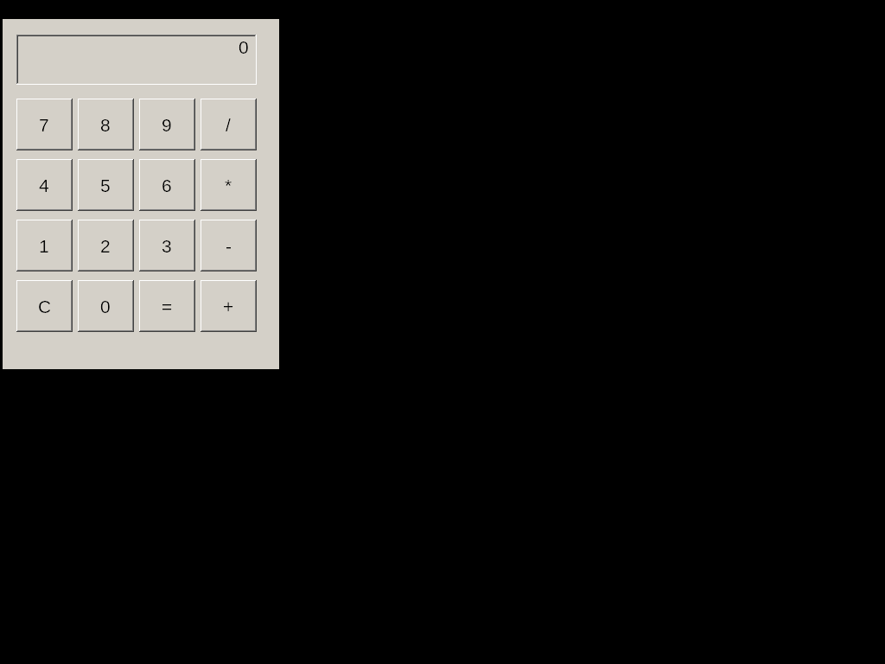
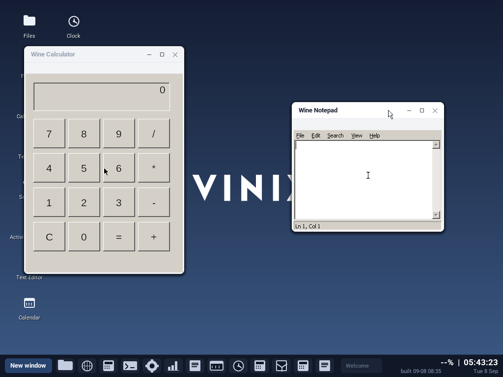

# Wine on Vinix

Vinix can build and run 64-bit Windows applications through Wine on amd64.
The port includes Wine's X11 driver, FreeType/fontconfig integration, and a
small end-to-end test executable.

Build Wine into the amd64 image with:

```sh
PKGS_TO_INSTALL='wine' make all
```

After booting Vinix, verify the complete path from the PE loader through the
Win32 console APIs with:

```sh
wine-smoke
```

Run another 64-bit Windows executable with `wine program.exe`. GUI programs
need Xorg running and `DISPLAY` set, in the same way as native X11 programs.

This native port is Win64-only and does not run 32-bit Windows binaries.

## AArch64 through x86-64 translation

The AArch64 image can run the Alpine x86-64 Wine build through QEMU user-mode
translation. Build the optional layer before assembling the userland or desktop
image:

```sh
./build-x86-translation-aarch64.sh
./build-userland-aarch64.sh
# Or rebuild the desktop image directly; it also discovers the staging layer.
./build-desktop-aarch64.sh
```

The layer keeps every x86-64 library under
`/usr/libexec/vinix-x86_64/root`; it never mixes guest libraries with Vinix's
native AArch64 `/usr/lib`. Inside Vinix, verify instruction translation, Linux
syscalls, the x86-64 musl loader, and Wine with:

```sh
/root/x86-translation-smoke.sh
wine-smoke
```

Open **Wine Calculator** or **Wine Notepad** from the Vinix desktop to run the
bundled Win64 applications as normal Vinix windows. Each private Xvfb display
is composited inside its window, so the wallpaper, taskbar, native applications,
window controls and switching all remain available; Xorg no longer replaces
the whole screen with a black root window. Pointer and keyboard events are
scoped to the corresponding Wine window and forwarded through XTEST.

The terminal commands `calculator` and `notepad` still start their direct X11
forms when an ordinary `DISPLAY` is already available. Other Win64 PE files
run with `wine64 program.exe`. A generic x86-64 Linux ELF can be launched with
`run-x86-64 program [arguments...]`.





Use `./build-x86-translation-aarch64.sh --translator-only` for the small Linux
translation layer without Wine. The Wine bundle is much larger because it
includes a complete private x86-64 graphics and multimedia dependency closure.
This path remains Win64-only; it does not include an i386 translator or the
32-bit half of Wine/WoW64.
