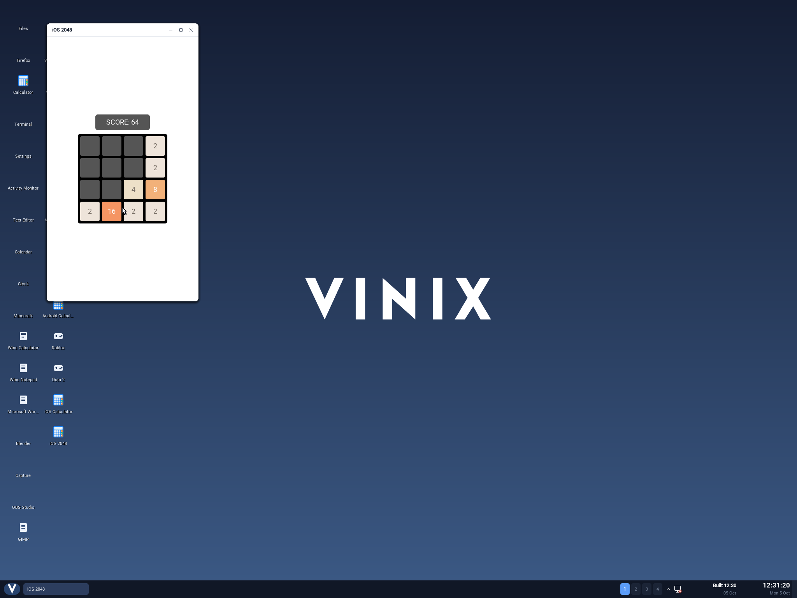

# Upstream iOS-2048 on Vinix

This builds Austin Zheng's [iOS-2048](https://github.com/austinzheng/iOS-2048),
an established open-source Objective-C/UIKit implementation of 2048 (335 GitHub
stars when selected on 2026-10-05). The upstream project is MIT licensed. Its
Objective-C game model, controllers, views, app delegate and entry point are
compiled without source changes into an ARM64 **iOS Mach-O**, then executed by
Vinix's V compatibility runtime.



The pinned revision is `7c0840a0f7bd77b01d6a36778a253f8f4b2e6529`.
The builder downloads it into the ignored `build/ios/2048/source` directory and
refuses a modified source checkout. The app bundle includes the original MIT
license, revision and launch storyboard. No Apple library implementations are
distributed.

## Build and launch

With Clang and `ld64.lld` installed:

```sh
./scripts/build-ios-aarch64.sh --with-2048
./scripts/build-desktop-aarch64.sh
./scripts/run-desktop-aarch64.sh --no-build
```

Open **iOS 2048**, click **Play Game**, and drag horizontally or vertically to
move tiles. Arrow keys and WASD invoke the app's registered swipe recognizers.
The build produces `NumberTileGame.app/NumberTileGame` and `NumberTileGame.ipa`
under `build/ios/2048`. The static runner and bundle are staged for the desktop;
`vinix-ios-2048` loads the installed Mach-O. To build only the app, run
`./examples/ios-2048/build.sh`.

The SDK declarations here supply only the public types and symbol names used
by this app, allowing a build on a Mac with command-line tools but no iPhoneOS
SDK. Clang targets `arm64-apple-ios15.0`, uses ARC and blocks, and links imports
from the ordinary iOS Foundation, UIKit, CoreGraphics, libobjc and libSystem
paths. `Info.plist` substitutes Xcode's product variables and selects ARM64.

The launch screen normally uses an `ibtool`-compiled storyboard. This build
preserves the upstream source XML instead. The V resource loader implements
its view/button/label, frame, color and target/action subset and reads the
initial controller from `UIMainStoryboardFile`. This is a resource compatibility
path, not support for arbitrary compiled storyboards or Auto Layout. The game
screen itself is built by the original Objective-C methods.

## Runtime additions

The app exercises Foundation arrays and dictionaries, value-equal index paths,
number boxing, constant strings, integer NSString formatting, fast enumeration,
zeroing weak references, copied blocks and one-shot NSTimers. UIKit adds nested
view ownership and removal, modal presentation, swipe recognition and alerts.
The runner executes the original game logic and block bodies from the Mach-O.

UIView animation blocks and completion callbacks run synchronously and display
the final positions and values. Sliding/pop interpolation and layer transforms
are not rendered yet. Fonts use the desktop's available font faces. Multi-touch,
general UIKit, Swift and general App Store binaries remain unsupported.

## Verification

```sh
# Host ARM64 runner, with ASan/UBSan:
v -enable-globals -cc clang -gc none \
  -cflags '-fsanitize=address,undefined' \
  -ldflags '-fsanitize=address,undefined' \
  -path "@vlib|$PWD/compat/ios|@vmodules" \
  -o build/ios/run-ios-host compat/ios/runner
./tests/ios/build-2048-model.sh
build/ios/run-ios-host build/ios/2048/model-tests
python3 tests/ios/game2048.py

# Real isolated Vinix guest: upstream model tests and interactive app protocol.
python3 tests/ios/run.py --with-2048

# Actual compositor and QEMU pointer swipes; writes build/ios/2048.ppm.
python3 tests/ios/desktop.py --app 2048 --desktop build/vinix-desktop
```

The model harness compiles all eight original upstream merge tests with a small
XCTest assertion shim, without editing the tests. It also checks collection
enumeration, block capture ownership and weak-reference zeroing. The app tests
check the upstream launch button, native presentation, initial two tiles,
swipes, increasing merge scores, timer callbacks, keyboard input and ARC teardown.
The desktop test sends actual QEMU pointer events and verifies score updates.

`VINIX_IOS_2048_BUILD_DIR`, `IOS_CLANG` and `IOS_LD` select app build inputs/output.
See [the runtime guide](../../docs/ios.md) for the broader ABI and build details.
